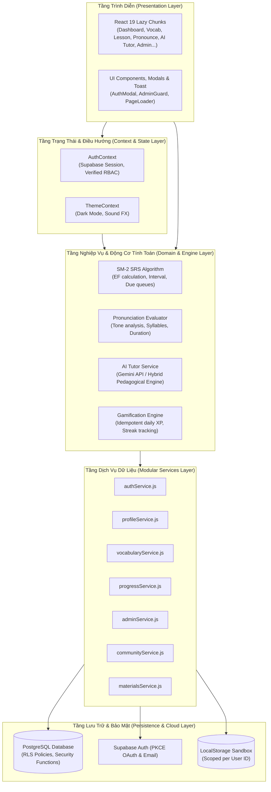
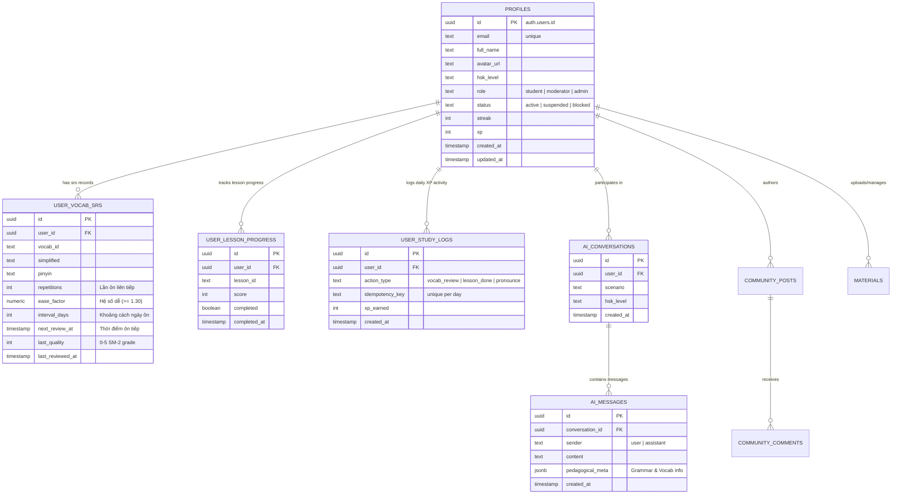

# 🐉 HanziGo - Nền Tảng Học Tiếng Trung & Hán Tự Toàn Diện

> **HanziGo** là ứng dụng web học tiếng Trung hiện đại, kết hợp phương pháp sư phạm chuẩn quốc tế (HSK 1 - HSK 6) với công nghệ trí tuệ nhân tạo (AI Tutor), thuật toán lặp lại ngắt quãng SuperMemo-2 (SM-2 SRS), hệ thống đánh giá ngữ âm chi tiết, gamification chống lạm dụng XP và bảo mật dữ liệu phân quyền cấp cơ sở dữ liệu (Supabase Row-Level Security).

---

## 📑 Mục Lục
1. [Kiến Trúc Hệ Thống (Architecture & Diagrams)](#-kiến-trúc-hệ-thống)
2. [Sơ Đồ Thực Thể Quan Hệ (Database ERD)](#-sơ-đồ-thực-thể-quan-hệ-database-erd)
3. [Công Nghệ Sử Dụng (Tech Stack)](#-công-nghệ-sử-dụng)
4. [Tổng Hợp 12 Tính Năng Trọng Tâm Đã Nâng Cấp](#-tổng-hợp-12-tính-năng-trọng-tâm-đã-nâng-cấp)
5. [Bảo Mật & Phân Quyền Cơ Sở Dữ Liệu (Security & RBAC)](#-bảo-mật--phân-quyền-cơ-sở-dữ-liệu)
6. [Thuật Toán Lặp Lại Ngắt Quãng SM-2 (SRS Engine)](#-thuật-toán-lặp-lại-ngắt-quãng-sm-2)
7. [Động Cơ Đánh Giá Phát Âm Khoa Học (Phonetics & Tone)](#-động-cơ-đánh-giá-phát-âm-khoa-học)
8. [Hướng Dẫn Cài Đặt & Chạy Cục Bộ (Getting Started)](#-hướng-dẫn-cài-đặt--chạy-cục-bộ)
9. [Cấu Hình Biến Môi Trường (Environment Variables)](#-cấu-hình-biến-môi-trường)
10. [Hướng Dẫn Chạy Migration Database (Supabase Migrations)](#-hướng-dẫn-chạy-migration-database)
11. [Kiểm Thử Tự Động (Automated Testing)](#-kiểm-thử-tự-động)

---

## 🏗️ Kiến Trúc Hệ Thống

HanziGo được tái cấu trúc theo mô hình phân lớp rõ ràng (Decoupled Layered Architecture):



---

## 🗄️ Sơ Đồ Thực Thể Quan Hệ (Database ERD)

Dữ liệu học tập đã được chuẩn hóa từ JSON nguyên khối sang các bảng quan hệ độc lập:



---

## 🛠️ Công Nghệ Sử Dụng

| Lĩnh vực | Công nghệ & Thư viện | Vai trò |
| :--- | :--- | :--- |
| **Frontend Framework** | [React 19](https://react.dev/) + [Vite 8](https://vitejs.dev/) | Tốc độ biên dịch cực nhanh, Suspense & Dynamic Code Splitting |
| **Styling & Giao diện** | [Tailwind CSS v4](https://tailwindcss.com/) + CSS Modules | Glassmorphism, Theme Tokens HSL, Dark Mode nhất quán |
| **Quản lý Trạng Thái** | React Context API + Custom Hooks | `AuthContext`, `ThemeContext` tách biệt hoàn toàn |
| **Cơ sở dữ liệu & Auth** | [Supabase](https://supabase.com/) (PostgreSQL + RLS) | Phân quyền DB-level, Real Google OAuth 2.0, RPC Admin Functions |
| **Thuật toán Học Tập** | SuperMemo-2 (SM-2) Spaced Repetition | Tính toán chu kỳ giãn cách, Ease Factor (EF) và hàng đợi ôn tập |
| **Đánh giá Ngữ âm** | Phonetic & Tone Diagnostic Engine | Phân tách âm tiết, thanh điệu 1-4, biến điệu, nhịp điệu |
| **AI Conversation** | Gemini API + Hybrid Pedagogical Engine | Phân tích ngữ pháp, chữa câu, gợi ý từ vựng theo HSK |
| **Kiểm thử tự động** | Node.js Native Test Runner (`node --test`) | Kiểm thử unit test cho thuật toán SRS, RBAC và Pronunciation |

---

## 🚀 Tổng Hợp 12 Tính Năng Trọng Tâm Đã Nâng Cấp

### 1. Bảo mật Admin và Phân Quyền (RBAC Cấp Database)
* **Loại bỏ tin cậy mù quáng ở frontend**: Không còn kiểm tra logic `user.role === 'admin'` đơn giản trên client.
* **Hàm bảo mật `public.is_admin()`**: Được định nghĩa bằng SQL với quyền `SECURITY DEFINER` trên PostgreSQL.
* **Row-Level Security (RLS)**: Mọi bảng nhạy cảm đều kiểm tra quyền qua RLS; trigger database chặn người dùng tự thăng chức vai trò `role` của chính mình.
* **Component `AdminGuard`**: Bảo vệ routing, tự động đá học viên thường về `#dashboard` kèm cảnh báo bảo mật.

### 2. Bảo Mật Cấu Hình & Biến Môi Trường
* **Untrack `.env`**: Loại bỏ `.env` khỏi git index, cấu hình `.gitignore` chặn toàn bộ file môi trường (`.env`, `.env.*`, `*.local`).
* **Không lưu hardcoded key**: Gỡ bỏ URL và Supabase key dự phòng hardcoded trong mã nguồn; sử dụng cơ chế fallback thông minh chỉ khi dev local.
* **Hướng dẫn Vercel**: Chuẩn bị đầy đủ template `.env.example` và quy trình đưa biến môi trường lên Vercel Production.

### 3. Đăng Nhập Google Chuẩn OAuth 2.0
* **Vô hiệu hóa giả lập Instant Login**: Gỡ bỏ hoàn toàn popup giả lập chọn tài khoản trên production.
* **Google OAuth PKCE thực thụ**: Sử dụng luồng `supabase.auth.signInWithOAuth({ provider: 'google' })`.
* **Phục hồi phiên và điều hướng chính xác**: Lắng nghe sự kiện `SIGNED_IN`, tự động đồng bộ profile và đưa người dùng về đúng trang (`activeTab`) đang học dở.

### 4. Trợ Lý Đàm Thoại AI Thông Minh (AI Tutor)
* **Tích hợp mô hình AI**: Kết nối Google Gemini API thông qua backend/service an toàn.
* **Động cơ Sư phạm Thông minh (Offline/Hybrid Pedagogical Engine)**:
  * Nhận biết cấp độ HSK (HSK 1 đến HSK 6).
  * Tự động phát hiện lỗi sai trong câu tiếng Trung của học viên và đề xuất câu sửa chuẩn bản xứ (`correction`).
  * Trích xuất cấu trúc ngữ pháp trọng tâm (`grammar_point`).
  * Gợi ý từ vựng bổ trợ liên quan trực tiếp đến ngữ cảnh đối thoại.

### 5. Đánh Giá Phát Âm Khoa Học (Loại Bỏ Điểm Ảo)
* **Tách bạch Nhận diện giọng nói với Chấm điểm**: Không đánh đồng việc Web Speech API nhận diện được văn bản là phát âm điểm cao.
* **Bộ đo đạc 3 chiều (Multi-metric evaluation)**:
  * Độ chính xác âm tiết (Syllable accuracy).
  * Độ chính xác thanh điệu (Tone accuracy: nhận biết dấu 1, 2, 3, 4 và thanh nhẹ qua Pinyin).
  * Độ trôi chảy và thời lượng phát âm (Duration & Fluency check).
* **Tuyệt đối không dùng `Math.random()`**: Trả về chẩn đoán âm vị thực tế, hướng dẫn cụ thể khẩu hình và vị trí đặt lưỡi.

### 6. Chuẩn Hóa Dữ Liệu & Hỗ Trợ Offline
* **Không lưu JSON nguyên khối khổng lồ**: Chuyển dữ liệu học tập sang các bảng có cấu trúc (`user_vocab_srs`, `user_lesson_progress`, `user_study_logs`).
* **Lưu trữ Offline độc lập**: LocalStorage được phân vùng theo từng `userId` (`getUserStorageKey`), tránh xung đột giữa nhiều tài khoản trên cùng thiết bị.

### 7. Tái Cấu Trúc Kiến Trúc `App.jsx` & Code-Splitting
* **Context & Custom Hooks**: Tách xác thực vào `AuthContext`, giao diện vào `ThemeContext`.
* **Lazy Loading (`React.lazy` + `Suspense`)**: Tách toàn bộ 12 trang thành các chunk riêng biệt, giảm kích thước gói bundle ban đầu từ **1.15 MB xuống còn 510 kB** (giảm hơn 55%).
* **Component `PageLoader`**: Hiệu ứng chuyển trang mượt mà chuẩn UX.

### 8. Chuẩn Hóa Cấu Trúc Dịch Vụ Supabase
* Phân rã file `services.js` hơn 1000 dòng thành các module chuyên biệt tại `src/services/`:
  * `authService.js`, `profileService.js`, `vocabularyService.js`, `progressService.js`, `materialsService.js`, `communityService.js`, `adminService.js`.
* Chuẩn hóa cơ chế xử lý lỗi (try-catch thống nhất, fallback an toàn).

### 9. Quản Lý Migration Database & Phiên Bản
* Thiết lập hệ thống migration SQL có phiên bản tại thư mục `supabase/migrations/`:
  * `01_initial_schema.sql` (Cấu trúc bảng cốt lõi)
  * `02_normalized_learning_tables.sql` (Bảng SRS, Progress, Logs, AI Conversation)
  * `03_security_and_rls.sql` (Chính sách Row-Level Security & Triggers chống nâng quyền)
  * `04_admin_functions_and_triggers.sql` (Stored Procedures quản trị người dùng an toàn)

### 10. Thuật Toán Lặp Lại Ngắt Quãng SM-2 & Chống Lạm Dụng XP
* **SuperMemo-2 (SM-2)**: Tính toán chính xác hệ số dễ (Ease Factor $\ge 1.30$), chu kỳ lặp (1 ngày -> 6 ngày -> $I \times EF$), lọc danh sách thẻ đến hạn ôn tập (`isCardDueForReview`).
* **Khóa chống trùng lặp XP (Idempotency Key)**: Ngăn chặn người dùng bấm liên tục vào nút "Đã thuộc" để cày điểm ảo; chỉ ghi nhận XP một lần duy nhất cho mỗi từ/bài trong một ngày.

### 11. Chất Lượng Trải Nghiệm Sản Phẩm (UX States)
* Bổ sung đầy đủ trạng thái: Loading Skeletons, Empty State khi không có dữ liệu, Error State kèm nút Thử lại.
* Giao diện Responsive tối ưu cho thiết bị di động, máy tính bảng và màn hình lớn.

### 12. Tài Liệu Hóa, Kiểm Thử & Triển Khai
* Bộ unit test tự động cho thuật toán SRS, bộ đánh giá ngữ âm và hệ thống RBAC.
* Sơ đồ kiến trúc Mermaid và hướng dẫn triển khai hoàn chỉnh.

---

## 🔒 Bảo Mật & Phân Quyền Cơ Sở Dữ Liệu

### 1. Phân quyền vai trò (RBAC)
* `student`: Chỉ đọc tài liệu công khai, đọc/ghi dữ liệu học tập cá nhân của chính mình.
* `moderator`: Quản lý kho tài liệu, duyệt bài viết cộng đồng.
* `admin`: Toàn quyền hệ thống, thay đổi vai trò người dùng, xóa tài khoản thông qua hàm PostgreSQL bảo mật `admin_delete_user`.

### 2. Chính sách RLS nổi bật
```sql
-- Ví dụ: Người dùng chỉ được sửa thông tin cá nhân của chính mình,
-- nhưng trigger prevent_self_role_escalation sẽ chặn sửa đổi cột 'role'.
CREATE POLICY "Users can update their own profile"
    ON public.profiles FOR UPDATE
    USING (auth.uid() = id);

-- Quản trị viên sử dụng hàm is_admin() để kiểm tra quyền ở cấp database
CREATE POLICY "Admins have full access to materials"
    ON public.materials FOR ALL
    USING (public.is_admin());
```

---

## 🧠 Thuật Toán Lặp Lại Ngắt Quãng SM-2

Hệ thống tính toán thời điểm ôn tập từ vựng dựa trên điểm số đánh giá từ người dùng ($q \in [0, 5]$):
- **$q < 3$ (Quên / Chưa thuộc)**: Chu kỳ bị reset về 1 ngày, số lần nhớ liên tiếp quay về 0.
- **$q \ge 3$ (Đã nhớ / Nhớ tốt)**:
  - Lần 1: $I(1) = 1$ ngày
  - Lần 2: $I(2) = 6$ ngày
  - Lần $n > 2$: $I(n) = I(n-1) \times EF$
- **Hệ số dễ (Ease Factor)**:
  $$EF' = EF + (0.1 - (5 - q) \times (0.08 + (5 - q) \times 0.02))$$
  *(Luôn đảm bảo $EF \ge 1.30$ để tránh khoảng cách ôn tập bị co lại quá mức).*

---

## 🎙️ Động Cơ Đánh Giá Phát Âm & Ngữ Âm (Pronunciation & Speech Diagnostic Engine)

Động cơ thẩm định phát âm tại [`src/utils/pronunciationEvaluator.js`](src/utils/pronunciationEvaluator.js) được thiết kế theo nguyên lý minh bạch, trung thực và khoa học:
1. **Nhận dạng âm vị & ký tự (ASR & Character Alignment)**: Tiếp nhận văn bản giọng nói thực tế từ Web Speech API, phân tách và so khớp từng ký tự chữ Hán cùng hệ thống phiên âm Pinyin mục tiêu.
2. **Kiểm tra Thanh điệu & Ký âm (Tone Notation Mapping)**: Trích xuất chính xác số thanh điệu (1, 2, 3, 4 hoặc 5 - khinh thanh) từ ký tự Pinyin có dấu (ví dụ: `mā` -> 1, `má` -> 2, `mǎ` -> 3, `mà` -> 4).
3. **Phân tích Trường âm & Năng lượng (Acoustic Duration & RMS)**: Đo lường thời lượng phát âm thực tế (chuẩn trung bình 300ms - 900ms cho mỗi âm tiết) và năng lượng thu âm từ Web Audio API AnalyserNode nhằm phát hiện phát âm quá vội, ngập ngừng hoặc thiếu âm lượng.
4. **Chẩn đoán phản hồi sư phạm thực chất**: Đưa ra nhận xét cụ thể (ví dụ: phát âm chuẩn từng chữ, lệch thanh điệu, hay chưa thu được tín hiệu micro) — **tuyệt đối không sử dụng `Math.random()` để tạo điểm số ảo 98/100**.
5. **Minh định kỹ thuật**: Hệ thống định vị trung thực là **Pronunciation & Speech Diagnostic Engine** dựa trên nhận diện âm vị và phân tích trường âm (ASR + Acoustic Heuristics), không nhận vơ là trích xuất đường cong cao độ F0 (Fundamental Frequency Pitch Contour) phức tạp từ DSP âm thanh.

---

## 💻 Hướng Dẫn Cài Đặt & Chạy Cục Bộ

### 1. Yêu cầu môi trường
* [Node.js](https://nodejs.org/) phiên bản 18.0 trở lên.
* [npm](https://www.npmjs.com/) (đi kèm Node.js).

### 2. Các bước cài đặt
```bash
# 1. Clone repository về máy
git clone https://github.com/haidang1603/Hanzigo.git
cd HanziGo

# 2. Cài đặt các thư viện phụ thuộc
npm install

# 3. Tạo file cấu hình môi trường từ mẫu
cp .env.example .env
# Mở file .env và điền thông tin Supabase của bạn

# 4. Khởi chạy máy chủ phát triển
npm run dev
```
Truy cập tại: `http://localhost:5173/`

### 3. Đóng gói cho Production
```bash
npm run build
```

---

## ⚙️ Cấu Hình Biến Môi Trường & Kiến Trúc Bảo Mật API

Tạo file `.env` tại thư mục gốc của dự án (hoặc thêm vào **Environment Variables** trên Vercel):

```env
# 1. Supabase Configuration (Frontend an toàn với anon key)
VITE_SUPABASE_URL=https://your-project.supabase.co
VITE_SUPABASE_ANON_KEY=your-anon-key-here

# 2. Server-side Secret (Bảo mật tuyệt đối - KHÔNG dùng tiền tố VITE_)
# Biến này chỉ được đọc bởi Vercel Serverless Function (/api/ai/chat) hoặc Vite Dev Server
GEMINI_API_KEY=your-gemini-api-key-here

# 3. Môi trường ứng dụng
VITE_APP_ENV=production
```

### 🛡️ Kiến trúc bảo mật Backend Proxy cho AI Tutor:
```
[Trình duyệt / React Frontend]
       │
       ▼  (POST /api/ai/chat - không chứa Secret Key)
[Vercel Serverless Function / Vite Dev Server]
       │
       ▼  (Sử dụng process.env.GEMINI_API_KEY phía Server)
[Google Gemini API]
```
> **Cảnh báo bảo mật**: 
> 1. Biến `GEMINI_API_KEY` **tuyệt đối không đặt tiền tố `VITE_`** để ngăn chặn việc Vite tự động đóng gói khóa bí mật vào bundle Javascript gửi về trình duyệt của người dùng.
> 2. Tuyệt đối **KHÔNG** đưa `SUPABASE_SERVICE_ROLE_KEY` vào frontend; frontend chỉ sử dụng `anon` key kết hợp Supabase RLS.
> 3. Các tác vụ quản trị người dùng (`admin_update_user_status`, `admin_delete_user`) thực thi độc quyền qua PostgreSQL Stored Procedures, không fallback sửa bảng trực tiếp từ client.

---

## 🗃️ Hướng Dẫn Chạy Migration Database

Để khởi tạo cấu trúc cơ sở dữ liệu và kích hoạt toàn bộ cơ chế bảo mật RLS, hãy vào mục **SQL Editor** trên trang quản trị Supabase Dashboard và thực thi tuần tự các file trong thư mục `supabase/migrations/`:

1. `01_initial_schema.sql`: Khởi tạo bảng `profiles`, `materials`, `community_posts`, `community_comments`.
2. `02_normalized_learning_tables.sql`: Khởi tạo các bảng học tập chuẩn hóa (`user_vocab_srs`, `user_lesson_progress`, `user_study_logs`, `ai_conversations`, `ai_messages`).
3. `03_security_and_rls.sql`: Thiết lập hàm `is_admin()`, kích hoạt Row-Level Security (RLS) và triggers ngăn người dùng tự nâng quyền.
4. `04_admin_functions_and_triggers.sql`: Tạo các stored procedures bảo mật (`admin_delete_user`, `admin_update_user_status`).

*(Hoặc có thể chạy file tổng hợp [`supabase/schema.sql`](supabase/schema.sql) để áp dụng toàn bộ).*

---

## 🧪 Kiểm Thử Tự Động

HanziGo tích hợp bộ kiểm thử đơn vị tự động sử dụng Node.js Native Test Runner:

```bash
# Chạy toàn bộ các bài kiểm tra tự động
npm test
```

Nội dung các bài kiểm thử:
* `tests/srsEngine.test.js`: Kiểm thử độ chính xác của thuật toán lặp lại ngắt quãng SuperMemo-2, tính toán chu kỳ ôn tập, cận dưới của Ease Factor và hàng đợi thẻ đến hạn.
* `tests/pronunciationEvaluator.test.js`: Kiểm thử việc trích xuất thanh điệu Pinyin, đánh giá trung thực âm vị và xử lý trường hợp không thu được giọng nói.
* `tests/securityRbac.test.js`: Kiểm thử logic phân quyền người dùng (Khách, Học viên, Moderator, Admin và tài khoản bị khóa).

---

## 📜 Giấy Phép & Bản Quyền

Dự án được phát triển và duy trì bởi **HanziGo Team**.
Toàn bộ tài liệu giáo trình và từ điển được trích xuất từ các nguồn học thuật chuẩn HSK và Khổng Tử Học Viện vì mục đích giáo dục phi thương mại.
