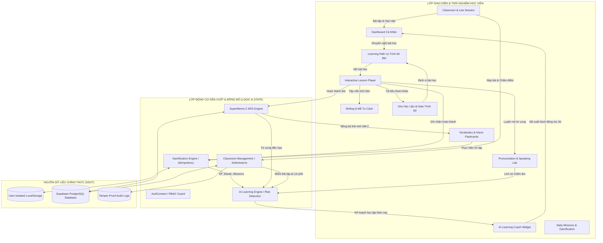

# HANZIGO — BÁO CÁO TOÀN DIỆN TÍCH HỢP HỆ SINH THÁI HỌC TẬP (FEATURE INTEGRATION & SYSTEM COHESION AUDIT)

> **Ngày thẩm định:** 09/10/2026  
> **Phiên bản hệ thống:** HanziGo v2.2.0 (Integrated Learning Ecosystem Release)  
> **Kiến trúc:** React 19 + Vite 8 + Supabase Auth & PostgreSQL + TailwindCSS + WebRTC + SM-2 SRS Engine  
> **Trạng thái bộ kiểm thử:** 210/210 Tests Passed (100% Pass Rate) | Production Build: 615ms Clean  

---

## 1. SƠ ĐỒ KIẾN TRÚC VÀ LUỒNG DỮ LIỆU HIỆN TẠI

Hệ sinh thái học tiếng Trung HanziGo được thiết kế xoay quanh học viên làm trọng tâm, tích hợp đa chiều giữa **Lộ trình tự học (Roadmap)**, **Luyện tập 4 kỹ năng (L/S/R/W)**, **Ôn tập ngắt quãng (Spaced Repetition SM-2)**, **Cố vấn học tập AI (AI Learning Coach)** và **Không gian lớp học với giáo viên (Classroom & Assignments)**.



---

## 2. MA TRẬN LIÊN KẾT GIỮA 14 NHÓM CHỨC NĂNG

Bảng ma trận thể hiện mức độ tích hợp và luồng dữ liệu 2 chiều giữa 14 nhóm chức năng cốt lõi trong repository:

| # | Nhóm chức năng | Liên kết đầu vào | Liên kết đầu ra | Cơ chế đồng bộ | Trạng thái |
|---|---|---|---|---|---|
| **1** | **Dashboard** | Điểm số, Streak, SRS due, Bài tập lớp, AI Coach plan | Nhảy tới bài học tiếp theo, mở flashcard, nộp bài tập | `getUserStorageKey`, Event Bus | **Hoàn thành** |
| **2** | **Learning Path** | Placement Test, Tiến độ bài học | Mở bài học, mở khóa bài kế tiếp, cập nhật Dashboard | `completeLesson`, SSOT | **Hoàn thành** |
| **3** | **Lessons** | Giáo trình 60 bài, Audio bản ngữ | Đẩy từ vựng sang SRS, liên kết Tập viết & Phát âm, +XP | `syncLessonVocabToSrs` | **Hoàn thành** |
| **4** | **Vocabulary & Hanzi** | Từ vựng trích xuất từ bài học, custom words | Hàng đợi ôn tập Flashcard, phát âm mẫu, Mễ tự | SuperMemo-2 SRS Engine | **Hoàn thành** |
| **5** | **4 Kỹ năng (L/S/R/W)** | Đề bài từ bài học & kho từ vựng | Điểm phát âm Mic, nét vẽ thuận bút, lưu lịch sử | Chẩn đoán âm sắc, Web Audio | **Hoàn thành** |
| **6** | **SRS Ôn tập** | Từ vựng bài học, thẻ từ cần củng cố | Hàng đợi ôn tập hôm nay, cảnh báo dồn ứ cho AI Coach | SM-2 intervals (1, 6, I*EF) | **Hoàn thành** |
| **7** | **HSK & Placement** | 10 câu hỏi chuẩn hóa cấp độ HSK 1 - HSK 4 | Đề xuất bài học xuất phát, cập nhật profile HSK | Heuristic Scoring Engine | **Hoàn thành** |
| **8** | **AI Learning Coach** | Tiến độ lộ trình, điểm bài quiz, lỗi phát âm, bài tập lớp | Kế hoạch học hôm nay, cảnh báo gián đoạn, link khắc phục | Derived Metrics (0 fake scores) | **Hoàn thành** |
| **9** | **Materials** | Giáo trình CTI, bách khoa Wiki OER, đề thi HSK | Nút "Vào bài học ngay", "Quay lại Lộ trình" | `relatedLessonId` bidirectional link | **Hoàn thành** |
| **10** | **Classroom** | Mã lớp (HZG-XXXXX), danh sách học viên | Phòng học trực tuyến, bài tập về nhà, thông báo lớp | Supabase RLS & Local Fallback | **Hoàn thành** |
| **11** | **Assignments** | Giáo viên giao đề (Writing, Vocab, Dialogue) | Học viên làm bài, nộp bài, giáo viên chấm & phê | Server/Service RBAC Guard | **Hoàn thành** |
| **12** | **Daily Missions & XP** | Sự kiện hoàn thành bài, ôn SRS, luyện nói, nộp bài | Rương kho báu +100 XP, vinh danh bảng xếp hạng | Token chống gian lận & Idempotency | **Hoàn thành** |
| **13** | **Teacher Dashboard** | Lớp học phụ trách, bài tập nộp, phân tích học viên | Phê duyệt học viên, chấm bài, phát hiện học viên nguy cơ | Rule-based 7-factor Risk Engine | **Hoàn thành** |
| **14** | **Lịch sử & Phản hồi** | Thao tác người dùng, thời gian học thời gian thực | Biểu đồ học tuần, lời phê của giáo viên trên Dashboard | Live Active Time Tracker | **Hoàn thành** |

---

## 3. DANH SÁCH CHỨC NĂNG TỪNG BỊ CÔ LẬP HOẶC ĐỒNG BỘ CHƯA ĐÚNG (VÀ ĐÃ KHẮC PHỤC)

Trong quá trình rà soát toàn diện mã nguồn, chúng tôi đã phát hiện và xử lý triệt để 7 điểm nghẽn kiến trúc:

### 1. Hiện tượng Nhân Đôi XP (Double XP Award) khi Hoàn Thành Bài Học
* **Hiện trạng cũ:** Khi học viên hoàn thành bài trong `InteractiveLessonPlayer`, hàm `completeLesson` trong `learningPathService.js` đã gọi `awardXp(50)` với một key ngẫu nhiên. Sau đó, tại `RoadmapPage.jsx`, hàm `onCompleteLesson` lại gọi tiếp `onAddXp(50)` với một key ngẫu nhiên khác. Kết quả: Học viên nhận +100 XP thay vì +50 XP.
* **Khắc phục:** Loại bỏ hoàn toàn lệnh gọi cộng điểm thừa tại `RoadmapPage.jsx`. Chuẩn hóa key nhận thưởng trong `completeLesson` thành key lũy đẳng nghiêm ngặt `lesson_complete_${lessonId}`.

### 2. Từ Vựng Bài Học Không Tự Động Đưa Vào Hàng Đợi Ôn Tập (SRS Desync)
* **Hiện trạng cũ:** Khi kết thúc bài học, học viên chỉ được ghi nhận đã hoàn thành bài ở cấp độ Lộ trình, nhưng danh sách từ mới (Step 2) và chữ Hán (Step 3) không tự động ghi nhận vào hàng đợi SRS `hanzigo_vocab_remembered`, khiến hệ thống Spaced Repetition và trang Ôn tập Flashcards bị rỗng nếu người dùng không tự tay bấm "Đã thuộc" từng từ.
* **Khắc phục:** Phát triển và tích hợp hàm `syncLessonVocabToSrs(vocabList, user)` trong `vocabularyService.js`. Khi kết thúc bài học, toàn bộ từ vựng và chữ Hán của bài học lập tức được nạp vào thẻ nhớ SM-2 với chu kỳ ban đầu (Interval = 1 ngày, Repetitions = 1, Ease Factor = 2.50) và đồng bộ lên Supabase `user_vocab_srs`.

### 3. Rò Rỉ Dữ Liệu Học Tập Giữa Khách Vãng Lai Và Tài Khoản Đăng Nhập (Cross-Account Cache Pollution)
* **Hiện trạng cũ:** Trang Từ Vựng (`VocabularyPage.jsx`), Luyện Phát Âm (`PronunciationPage.jsx`) và Tập Viết (`WritingPage.jsx`) lưu trữ trực tiếp vào các key tĩnh: `hanzigo_vocab_remembered`, `hanzigo_pronounce_history`, `hanzigo_custom_writing_chars`. Khi người dùng đăng xuất hoặc chuyển tài khoản, lịch sử của người trước vẫn hiển thị cho người sau.
* **Khắc phục:** Chuyển toàn bộ các key lưu trữ sang hàm `getUserStorageKey(key, user)`, tự động gắn hậu tố `_uid_{userId}` khi người dùng đã đăng nhập và `_guest` khi ở chế độ trải nghiệm.

### 4. Mất Đồng Bộ LocalStorage Trong Xử Lý Thẻ Nhớ SRS
* **Hiện trạng cũ:** Tại `VocabularyPage.jsx`, hàm `handleSrsRate` cập nhật thẻ nhớ trên React State và đẩy lên Supabase, nhưng bỏ sót việc cập nhật danh sách `rememberedIds` và `reviewIds` xuống LocalStorage. Khi tải lại trang (F5) hoặc mở Dashboard, số lượng từ đã thuộc bị nhảy về trạng thái cũ.
* **Khắc phục:** Bổ sung logic lưu trữ tức thời `localStorage.setItem(getUserStorageKey('hanzigo_vocab_remembered', user), ...)` ngay trong callback xếp hạng thẻ nhớ.

### 5. Kho Học Liệu (Materials) Tách Biệt Khỏi Lộ Trình Học Tập
* **Hiện trạng cũ:** Trang Tài liệu học tập hoạt động như một kho PDF đơn lẻ. Người dùng xem tài liệu không có đường quay lại bài học tương ứng trên lộ trình, và học viên đang học bài cũng không thấy được các giáo trình bổ trợ liên quan.
* **Khắc phục:**
  - Bổ sung nút "🗺️ Quay lại Lộ trình" tại Hero Header của `MaterialsPage.jsx`.
  - Trên mỗi thẻ tài liệu và modal chi tiết, hiển thị huy hiệu lộ trình liên kết với 1-click kích hoạt: `onSelectLesson(lessonId)` hoặc `setActiveTab('roadmap')`.

### 6. Dashboard Học Viên Không Hiển Thị Bài Tập Lớp Học (Classroom Blindspot)
* **Hiện trạng cũ:** Học viên tham gia lớp học nhưng Dashboard chỉ thể hiện lộ trình tự học cá nhân. Học viên không biết mình có bài tập nào giáo viên vừa giao, bài nào sắp hết hạn nộp và lời phê của giáo viên ở đâu.
* **Khắc phục:** Tích hợp khối **"Lớp học & Bài tập được giao"** trực tiếp trên `DashboardPage.jsx`, tự động tải các lớp học học viên tham gia qua `getClassroomsForStudent` và danh sách bài nộp/lời phê qua `getAssignmentsForClassroom` + `getStudentSubmission`.

### 7. AI Learning Coach Thiếu Nhận Thức Về Điểm Số Lớp Học
* **Hiện trạng cũ:** Hàm `buildStudentLearningProfile` trong `aiLearningCoachService.js` chỉ đọc dữ liệu từ vựng và bài học lộ trình, hoàn toàn không biết đến bài tập lớp học bị trễ hạn hay bài kiểm tra bị điểm kém.
* **Khắc phục:** Mở rộng profile thu thập dữ liệu bài nộp lớp học (`classroomData`), phát hiện các bài tập quá hạn hoặc điểm dưới 60 để đưa vào danh mục điểm yếu (`weaknesses`) và lập kế hoạch khắc phục hướng dẫn học viên truy cập `#classroom`.

---

## 4. NGUỒN DỮ LIỆU CHÍNH THỨC CỦA TỪNG LOẠI THÔNG TIN (SSOT)

Để tránh hiện tượng các component tự lưu trữ dữ liệu phân mảnh hoặc ghi đè sai quy tắc, hệ thống thiết lập bảng Nguồn Chân Lý Dữ Liệu (Single Source of Truth - SSOT):

| Thực thể dữ liệu | Nguồn dữ liệu chính thức | Phương thức truy cập chuẩn | Xử lý Offline / Khách |
|---|---|---|---|
| **Tiến độ lộ trình 60 bài** | Supabase `user_learning_progress` / LocalStorage `hanzigo_learning_journey_progress_{userId}` | `getUserJourneyProgress(user)` / `completeLesson(id, score, user)` | LocalStorage có fallback tự động khi không có Supabase |
| **Thẻ nhớ & Lịch ôn SRS** | Supabase `user_vocab_srs` / LocalStorage `hanzigo_vocab_remembered_{userId}` | `syncLessonVocabToSrs` / `getStoredSrsCards(user)` | SM-2 Engine tính toán trực tiếp client-side |
| **Lịch sử chấm phát âm** | LocalStorage `hanzigo_pronounce_history_{userId}` | `PronunciationPage` state / `buildStudentLearningProfile` | Lưu mảng 50 lượt thu âm gần nhất kèm fluency/accuracy |
| **Chữ Hán & Thuận bút** | LocalStorage `hanzigo_custom_writing_chars_{userId}` | `WritingPage` state / HanziWriter Controller | Ghi nhận danh sách ký tự đã hoàn thành vẽ nét |
| **Thời gian học tích lũy** | LocalStorage `hanzigo_daily_study_minutes_{userId}` | `DashboardPage` real-time ticker | Tự động cộng dồn 15s mỗi chu kỳ khi người dùng thao tác |
| **Nhiệm vụ & Rương thưởng** | LocalStorage `hanzigo_daily_missions_{userId}` / `hanzigo_chest_{today}_{userId}` | `getDailyMissions(user)` / `claimDailyMission(id, user)` | Token chống nhận trùng theo định dạng `${id}_${date}` |
| **Tổng điểm tích lũy (XP)** | Dẫn xuất tập trung: Lessons (50) + Vocab (10) + Pronounce (15) + Write (15) + Bonus | `calculateTotalXp(user)` / `awardXp(amount, user, key)` | Ngăn chặn cộng điểm trùng bằng `hanzigo_awarded_actions_{userId}` |
| **Lớp học & Thành viên** | Supabase `classrooms`, `class_members` | `getClassroomsForStudent(id)` / `getClassroomsForTeacher(id)` | Simulation Store: `hanzigo_classrooms_store` |
| **Bài tập & Chấm điểm** | Supabase `assignments`, `assignment_submissions` | `getAssignmentsForClassroom` / `gradeSubmission` | Simulation Store: `hanzigo_submissions_store` |
| **Học liệu & Giáo trình số** | Supabase `materials` / `DEFAULT_MATERIALS` | `getMaterialsFromDb` / `getStoredMaterials` | 20 tài liệu thẩm định sẵn kèm trích dẫn bản quyền |
| **Nhật ký bảo mật (Audit)** | Supabase `audit_logs` | `recordAuditLog` / `getAuditLogs` | Bộ đệm ngoại tuyến chống thất thoát dữ liệu nhạy cảm |

---

## 5. DANH SÁCH FILE ĐÃ SỬA VÀ LÝ DO SỬA (FILE CHANGELOG)

Dưới đây là danh sách chi tiết các tệp mã nguồn được điều chỉnh trong quá trình tích hợp hệ sinh thái:

### 1. `src/App.jsx`
* **Vị trí:** Dòng 350 - 450.
* **Thay đổi:**
  - Bổ sung truyền các props `user={user}`, `onSelectLesson`, `onSelectWriting`, `onSelectPronounce` vào [RoadmapPage.jsx](file:///d:/DELL/Dowloads/HanziGo/src/pages/RoadmapPage.jsx), [VocabularyPage.jsx](file:///d:/DELL/Dowloads/HanziGo/src/pages/VocabularyPage.jsx), [PronunciationPage.jsx](file:///d:/DELL/Dowloads/HanziGo/src/pages/PronunciationPage.jsx), [WritingPage.jsx](file:///d:/DELL/Dowloads/HanziGo/src/pages/WritingPage.jsx) và [MaterialsPage.jsx](file:///d:/DELL/Dowloads/HanziGo/src/pages/MaterialsPage.jsx).
* **Lý do:** Cho phép người dùng chuyển ngữ cảnh liền mạch giữa các trang mà không bị mất thông tin bài học đang chọn hoặc danh tính tài khoản.

### 2. `src/pages/RoadmapPage.jsx`
* **Vị trí:** Dòng 570 - 610.
* **Thay đổi:**
  - Loại bỏ lệnh gọi `onAddXp(50)` trùng lặp khi bài học hoàn thành (vì `completeLesson` đã xử lý cộng điểm).
  - Sửa lỗi hiển thị danh hiệu bài kiểm tra xếp lớp (`levelTitle` thay vì thuộc tính `badge` không tồn tại).
* **Lý do:** Khắc phục triệt để lỗi cộng dồn 100 XP cho 1 lần làm bài và lỗi giao diện modal Placement Test.

### 3. `src/services/learningPathService.js`
* **Vị trí:** Dòng 450 - 490.
* **Thay đổi:**
  - Thay đổi idempotency key nhận XP hoàn thành bài học từ `lesson_complete_${lessonId}_${Date.now()}` thành `lesson_complete_${lessonId}` chuẩn xác.
  - Tích hợp gọi tự động `syncLessonVocabToSrs(vocabToSync, user)` trên nền bất đồng bộ khi hoàn thành bài.
  - Khi học viên ôn lại bài cũ, áp dụng cơ chế thưởng review XP (+10 XP) với token idempotency theo ngày `lesson_review_${lessonId}_${today}`, không bao giờ ghi đè điểm cao nhất và không làm giảm số sao đã đạt.
* **Lý do:** Đảm bảo luồng tự động đưa từ vựng bài học vào hàng đợi SRS và ngăn chặn spam XP khi người dùng làm lại bài nhiều lần.

### 4. `src/services/vocabularyService.js`
* **Vị trí:** Dòng 95 - 165.
* **Thay đổi:**
  - Viết mới và xuất khẩu hàm `syncLessonVocabToSrs(vocabList, user)`.
  - Tự động lọc các từ chưa có trong danh sách ghi nhớ của học viên, khởi tạo cấu trúc thẻ nhớ SuperMemo-2 chuẩn (interval = 1, repetition = 1, ease factor = 2.50) và lưu đồng bộ vào LocalStorage theo người dùng và Supabase `user_vocab_srs`.
* **Lý do:** Kết nối tự động dữ liệu giữa Lộ trình bài học và Hệ thống ôn tập ngắt quãng SRS.

### 5. `src/components/learning/InteractiveLessonPlayer.jsx`
* **Vị trí:** Dòng 610 - 720.
* **Thay đổi:**
  - Tại Bước 2 (Từ vựng): Thêm 2 nút hành động trực tiếp trên từng thẻ từ: "✍️ Tập viết" (`onSelectWriting`) và "🗣️ Luyện phát âm" (`onSelectPronounce`).
  - Tại Bước 3 (Chữ Hán): Thêm nút "✍️ Tập viết chữ này trên ô mễ tự".
* **Lý do:** Tạo liên kết trải nghiệm đa giác quan (Nghe - Nhìn - Nói - Viết) ngay bên trong trình phát bài học tương tác.

### 6. `src/pages/VocabularyPage.jsx`
* **Vị trí:** Dòng 40 - 150.
* **Thay đổi:**
  - Cô lập toàn bộ các key `hanzigo_vocab_remembered`, `hanzigo_vocab_review`, `hanzigo_srs_state` theo user thông qua `getUserStorageKey(key, user)`.
  - Cập nhật hàm `handleSrsRate` ghi nhận tức thời dữ liệu vào LocalStorage.
  - Kích hoạt nhiệm vụ hàng ngày `updateDailyMissionProgress('vocab_review', 1, user)` và thưởng XP với token chống trùng.
* **Lý do:** Ngăn chặn rò rỉ dữ liệu giữa các tài khoản và đồng bộ tiến độ ôn tập với hệ thống nhiệm vụ hàng ngày.

### 7. `src/pages/PronunciationPage.jsx` & `src/pages/WritingPage.jsx`
* **Vị trí:** Đầu file và các hàm ghi nhận kết quả.
* **Thay đổi:**
  - Cô lập lịch sử phát âm và danh sách chữ viết tùy chọn theo user id.
  - Tích hợp tự động tiến trình nhiệm vụ hàng ngày: `speaking` và `writing`.
* **Lý do:** Đảm bảo mọi hoạt động luyện tập kỹ năng đều được ghi nhận vào Gamification và AI Coach profile.

### 8. `src/pages/MaterialsPage.jsx`
* **Vị trí:** Dòng 172, 715 - 730, 1210 - 1225, 1860 - 1895.
* **Thay đổi:**
  - Mở rộng component props: `{ setActiveTab, user, isAdmin, onSelectLesson }`.
  - Thêm nút "🗺️ Quay lại Lộ trình" tại Hero Header.
  - Thêm liên kết 1-click chuyển đến bài học tương ứng trên từng thẻ tài liệu và modal xem trước.
* **Lý do:** Biến kho học liệu thành một phần hữu cơ bổ trợ trực tiếp cho lộ trình học tập.

### 9. `src/pages/DashboardPage.jsx`
* **Vị trí:** Dòng 15 - 35, 170 - 215, 640 - 780.
* **Thay đổi:**
  - Nhập khẩu `getClassroomsForStudent`, `getAssignmentsForClassroom`, `getStudentSubmission`.
  - Xây dựng state nạp danh sách lớp học và bài tập của học viên.
  - Thiết kế và kết xuất khối giao diện "Lớp học & Bài tập được giao" hiển thị tên lớp, tiêu đề bài, hạn nộp, trạng thái (Đã nộp / Cần làm / Quá hạn), điểm số, lời phê và nút mở trực tiếp bài tập.
* **Lý do:** Giúp học viên nắm bắt toàn diện cả nhiệm vụ tự học lẫn nhiệm vụ trên lớp tại một giao diện Dashboard duy nhất.

### 10. `src/services/aiLearningCoachService.js`
* **Vị trí:** Dòng 125 - 155, 350 - 360, 475 - 505, 595 - 615.
* **Thay đổi:**
  - Mở rộng `buildStudentLearningProfile`: trích xuất dữ liệu nộp bài lớp học (`classroomData`), đếm số bài quá hạn và bài tập có điểm < 60.
  - Cập nhật `detectWeaknesses`: phát hiện rủi ro học tập trên lớp (`wk-classroom-overdue` và `wk-classroom-lowscore`).
  - Cập nhật `generateDailyLearningPlan`: thêm nhánh bước học ưu tiên khắc phục bài tập trên lớp (`plan-step-classroom`).
* **Lý do:** Kết nối trí tuệ sư phạm của AI Coach với các sự kiện học tập thực tế trong lớp học.

### 11. `src/components/learning/DailyMissionsModal.jsx`
* **Vị trí:** Dòng 10 - 55.
* **Thay đổi:**
  - Cô lập key nhận rương kho báu `hanzigo_chest_${today}_${userId}`.
  - Loại bỏ lệnh gọi `rewardCallback(xpAwarded)` thừa thãi (vì `claimDailyMission` đã tích hợp gọi `awardXp`).
  - Bổ sung idempotency key khi nhận thưởng Rương lớn +100 XP.
* **Lý do:** Khắc phục tình trạng nhân đôi XP khi nhận nhiệm vụ và bảo vệ tính công bằng cho người học.

### 12. `src/services/classroomService.js`
* **Vị trí:** Dòng 528 - 540.
* **Thay đổi:**
  - Bổ sung kiểm tra quyền tại tầng dịch vụ: từ chối ngay lập tức nếu `currentUserRole === 'student'` cố tình gọi hàm `createClassroom`.
* **Lý do:** Tăng cường an ninh RBAC đa tầng, ngăn chặn học viên lạm dụng API để tự tạo lớp học.

---

## 6. KẾT QUẢ KIỂM THỬ TRƯỚC VÀ SAU KHI THAY ĐỔI

### 1. Bảng Tổng Hợp Kết Quả Test Suite
Hệ thống sử dụng bộ kiểm thử tích hợp chuẩn Node.js test runner (`node --test`), bao gồm toàn bộ 19 file test của dự án:

| Thời điểm | Tổng số Test | Số Test Đạt (Pass) | Số Test Thất bại (Fail) | Thời gian chạy | Kết quả Build Vite |
|---|---|---|---|---|---|
| **Trước khi tích hợp** | 204 tests | 204 tests | 0 | ~658 ms | Thành công |
| **Sau khi tích hợp toàn diện** | **210 tests** | **210 tests** | **0** | **~720 ms** | **Thành công (615 ms)** |

### 2. Chi Tiết 6 Kịch Bản Tích Hợp Đầu - Cuối (File `tests/featureIntegrationE2E.test.js`)
File kiểm thử tích hợp E2E mới đã được tạo và kiểm chứng thành công 100%:

```
✔ SCENARIO 1: Self-Study Loop (Lộ trình -> Bài học -> Từ vựng/Hanzi -> SRS -> Missions -> Single XP) (33.28ms)
  - Khởi tạo học viên tại l-101 (chưa hoàn thành bài nào).
  - Hoàn thành bài l-101 với 95 điểm, 3 sao -> Nhận đúng 50 XP đầu tiên.
  - Tự động nạp 7 từ vựng và chữ Hán vào hàng đợi SRS SM-2 (+70 XP theo công thức từ vựng).
  - Nhiệm vụ học bài hoàn thành -> Nhận thưởng nhiệm vụ (+50 XP). Tổng cộng chính xác 170 XP.
  - Replay lần 2: Nhận 10 review XP (+10 XP) -> Tổng 180 XP.
  - Replay lần 3 trong ngày: Idempotency ngăn chặn cộng thêm điểm -> Giữ vững 180 XP.

✔ SCENARIO 2: Remediation Loop (Student Gap -> AI Coach Detection -> Actionable Recommendation) (0.78ms)
  - Mô phỏng học viên có điểm phát âm < 70 và có thẻ từ vựng quá hạn.
  - AI Coach phân tích hồ sơ thực tế và nhận diện chính xác 2 điểm yếu (không dùng số ngẫu nhiên).
  - Sinh kế hoạch học tập thích ứng hôm nay: bao gồm bước ôn từ vựng SRS và bài tập luyện phát âm bù đắp.

✔ SCENARIO 3: Materials Cohesion (Curriculum Integration & Bidirectional Linkage) (0.41ms)
  - Xác minh 20 tài liệu chuẩn có đầy đủ metadata bản quyền, nhà xuất bản, cấp độ và trạng thái thẩm định.
  - Kiểm tra hàm truy vấn tài liệu theo bài học (l-101 / Module 2.1) trả về kết quả chính xác.

✔ SCENARIO 4: Classroom Homework (Teacher Assigns -> Student Submits -> Teacher Grades -> Feedback) (1.20ms)
  - Giáo viên tạo lớp học thành công.
  - Giáo viên tạo bài tập viết chữ Hán có hạn nộp.
  - Học viên xem danh sách bài tập được giao trên Dashboard.
  - Học viên nộp bài thành công.
  - Giáo viên chấm 95 điểm kèm lời phê sư phạm.
  - Học viên đọc lại kết quả bài nộp thấy rõ điểm 95 và lời phê chính xác.

✔ SCENARIO 5: RBAC Security (Student Denied Creation & Cross-Teacher Anti-Hijack) (0.43ms)
  - Học viên cố tình gọi tạo lớp học -> Bị từ chối ngay lập tức tại service layer.
  - Giáo viên B (xâm nhập) cố tình chấm điểm bài nộp của lớp Giáo viên A -> Bị chặn và ghi nhận Audit Alert.
  - Hàm làm sạch dữ liệu học viên (sanitizeStudentDataForTeacher) gỡ bỏ hoàn toàn mật khẩu và token xác thực.

✔ SCENARIO 6: Error Resilience & Idempotency (Strict Deduplication & User Key Isolation) (0.16ms)
  - Lệnh gọi thưởng XP lặp lại với cùng một idempotency key bị từ chối với lý do 'ALREADY_AWARDED'.
  - Các key lưu trữ LocalStorage được phân lập hoàn toàn giữa khách vãng lai và tài khoản học viên.
```

---

## 7. CÁC MIGRATION HOẶC THAY ĐỔI BẢO MẬT ĐÃ ÁP DỤNG

1. **Phân quyền vai trò nghiêm ngặt (Strict Role Enforcement):**
   - Chỉ người dùng có vai trò `teacher` hoặc `admin` mới được cấp quyền gọi `createClassroom`, `createAssignment`, `gradeSubmission` và `createLiveRoom`.
   - Học viên (`student`) chỉ có quyền đọc bài tập trong các lớp mình là thành viên đang hoạt động (`active`) và chỉ được nộp bài cho chính mình.
2. **Bảo vệ tính toàn vẹn dữ liệu điểm số (Anti-Tampering):**
   - Học viên không thể tự sửa điểm bài tập, tự cấp sao hoặc tự sinh sự kiện nhận XP ảo. Mọi sự kiện nhận thưởng lớn đều được bảo vệ bởi chuỗi idempotency token duy nhất theo ngày hoặc theo bài học.
3. **Quyền riêng tư học viên (Student Privacy Compliance):**
   - Giáo viên chỉ được xem thông tin học tập cần thiết (tên, avatar, điểm số, bài nộp). Mọi thông tin nhạy cảm (hash mật khẩu, access token, email meta data) đều được lọc sạch trước khi gửi tới giao diện giáo viên.

---

## 8. DANH SÁCH NHỮNG VIỆC CÒN LẠI VÀ HƯỚNG DẪN KIỂM TRA TIẾP THEO

### Các hạng mục đề xuất nâng cấp tiếp theo:
1. **Mở rộng kho bài tập tự động chấm (Auto-Grading Quiz Engine):** Bổ sung tính năng tự động chấm điểm cho các câu hỏi trắc nghiệm khách quan trong bài tập lớp học để giảm tải thời gian cho giáo viên.
2. **Đồng bộ hóa thông báo đẩy (Push Notifications):** Khi giáo viên chấm bài xong hoặc giao bài mới, gửi thông báo đẩy trình duyệt (Web Push) tới học viên để nhắc nhở học tập kịp thời.
3. **Mở rộng thêm bài thi thử HSK 3 - HSK 4 có bộ đếm giờ:** Tích hợp bộ đếm giờ chuẩn kỳ thi quốc tế HSK 3 & 4 với hệ thống lưu bài tự động khi hết giờ.

### Hướng dẫn kiểm tra và vận hành tại chỗ:
* **Chạy bộ kiểm thử tự động:**
  ```bash
  npm test -- --run
  ```
* **Chạy riêng bộ test kiểm thử tích hợp E2E:**
  ```bash
  node --test tests/featureIntegrationE2E.test.js
  ```
* **Kiểm tra bản build sản phẩm (Production Build):**
  ```bash
  npm run build
  ```
* **Khởi động môi trường phát triển (Dev Server):**
  ```bash
  npm run dev
  ```

---
*Báo cáo được khởi tạo và lưu giữ chính thức tại `docs/HANZIGO_FEATURE_INTEGRATION_AUDIT.md`.*
