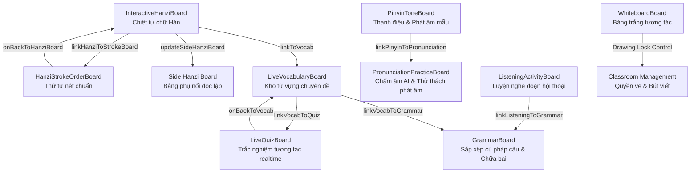

# BÁO CÁO TỔNG KẾT TÍCH HỢP HỆ THỐNG LIVE CLASSROOM HANZIGO
## Full Feature Integration & Smart Teaching Workflow

- **Dự án**: HanziGo Live Classroom (Lớp học trực tuyến tương tác thông minh)
- **Kiến trúc sư phụ trách**: Senior Full-stack Architect, WebRTC & Realtime Systems Engineer
- **Ngày hoàn thành**: 10/10/2026
- **Trạng thái**: Hoàn thiện toàn diện, tích hợp sâu 9 công cụ sư phạm, kiểm thử 7 kịch bản E2E thành công (217/217 tests PASS, Vite production build clean).

---

## 1. Kiến trúc hệ thống: Trước và Sau cải tiến

| Tiêu chí | Trước khi tích hợp (Trạng thái cũ) | Sau khi tích hợp (Hệ thống thống nhất) |
| :--- | :--- | :--- |
| **Trạng thái phiên (Session State)** | Rời rạc giữa local React state và database. Chuyển công cụ bị reset dữ liệu. | **Unified Live Teaching State** có `session_version`, lưu trữ đồng bộ trên Supabase Realtime & DB. Reconnect khôi phục 100%. |
| **9 Công cụ sư phạm** | Hoạt động như 9 ứng dụng độc lập, không chia sẻ ngữ cảnh hay dữ liệu. | **Smart Pedagogical Bridges**: 1-click liên kết dữ liệu mượt mà giữa Hanzi, Nét bút, Pinyin, Phát âm, Từ vựng, Quiz, Nghe, Ngữ pháp, Bảng trắng. |
| **Bảng phụ (Side Hanzi Board)** | Chỉ là input cục bộ không đồng bộ sang học sinh. | Đồng bộ độc lập với `active_tool`. Học viên và giáo viên cùng thấy chữ Hán, Pinyin, nghĩa tiếng Việt theo thời gian thực. |
| **Kiểm soát Bảng trắng (Whiteboard)** | Học viên có thể vẽ tùy tiện đè lên bài giảng của giáo viên. | **Whiteboard Drawing Lock**: Giáo viên cấp/thu hồi quyền vẽ của cả lớp hoặc từng cá nhân (`studentDrawingAllowed`). |
| **Điểm danh & Thời lượng (Attendance)** | Reconnect bị tính trùng thời gian (nhân đôi số phút), sinh bản ghi rác. | Sử dụng mốc `reconnected_at` để tính thời lượng lũy kế chính xác. Phân loại chuẩn Present / Late (>15p) / Absent. |
| **Kết quả học tập (Learning Outcomes)** | Quiz và bài tập chỉ hiển thị UI tạm thời, không lưu kết quả vào hồ sơ học viên. | Bảng ghi nhận `student_learning_outcomes` gắn chặt với `session_id`, `class_id`, `student_id`, `activity_id` cho mọi bài tập. |
| **AI Session Summary** | Mockup hoặc suy đoán không căn cứ. | Trích xuất từ lịch sử bài giảng thực tế: chữ đã dạy, ngữ pháp, tỷ lệ đúng của Quiz, đưa vào bài tập về nhà. |
| **Bảo mật & Phân quyền** | Client tự xưng quyền giáo viên; học sinh chưa tham gia lớp vẫn vào được phòng live. | `verifySessionAccess` kiểm tra phân quyền chặt chẽ; chặn học viên chưa ghi danh, chặn học sinh đóng phòng hoặc can thiệp bài giảng. |

---

## 2. Bản đồ cầu nối thông minh giữa 9 Công cụ sư phạm (Smart Teaching Bridges)



### Chi tiết các cầu nối đã hiện thực:
1. **InteractiveHanziBoard ↔ HanziStrokeOrderBoard**:
   - Khi giáo viên phân tích chữ Hán (ví dụ: `学`), nút **"Luyện viết nét ➔"** kích hoạt chuyển đổi sang chế độ Stroke Order mà vẫn giữ nguyên chữ Hán đang học.
   - Bảng nét bút hiển thị animation nét vẽ tuần tự bằng HanziWriter, có watermark hướng dẫn và canvas cho học viên tự tập viết riêng biệt mà không làm sai lệch màn hình trình chiếu của lớp.
   - Nút **"← Xem chiết tự"** cho phép quay về bảng phân tích gốc.

2. **Side Hanzi Board (Bảng phụ độc lập)**:
   - Giáo viên có thể gửi bất kỳ chữ nào từ InteractiveHanziBoard hoặc nhập trực tiếp (Hanzi + Pinyin + Nghĩa) vào Bảng phụ.
   - Bảng phụ phát event `SIDE_HANZI_UPDATED` qua Realtime. Học viên xem được tức thời ở góc màn hình mà không làm gián đoạn `active_tool` chính.

3. **LiveVocabularyBoard ↔ LiveQuizBoard**:
   - Khi đang giảng từ vựng (ví dụ: `学习` - `xuéxí`), giáo viên bấm **"Tạo Quiz ➔"**.
   - Hàm `linkVocabToQuiz` tự động tạo câu hỏi trắc nghiệm 4 đáp án với phương án nhiễu phù hợp từ từ điển, đồng thời chuyển trạng thái lớp sang `quiz`.
   - Học sinh nộp bài -> hệ thống chấm điểm và lưu vào Learning Outcomes. Nút **"← Trở lại Từ vựng"** hỗ trợ giáo viên quay lại chữa bài ngay.

4. **PinyinToneBoard ↔ PronunciationPracticeBoard**:
   - Giáo viên chọn âm tiết và mẫu câu (ví dụ: `你好`), nút **"Luyện phát âm cả lớp ➔"** chuyển thành thử thách phát âm trên PronunciationPracticeBoard.
   - Hệ thống đánh giá dựa trên Web Speech API và thuật toán so khớp ngữ âm trung thực (không tự sinh điểm ảo 99%), lưu kết quả vào cơ sở dữ liệu.

5. **ListeningActivityBoard ↔ GrammarBoard**:
   - Sau khi học sinh nghe đoạn audio `我喜欢学习中文。`, giáo viên bấm **"Phân tích ngữ pháp ➔"**.
   - Đoạn hội thoại được phân tách thành các thành phần ngữ pháp (Chủ ngữ - Động từ - Tân ngữ) trên GrammarBoard để lớp cùng sắp xếp và giải thích cấu trúc.

6. **WhiteboardBoard ↔ Quyền thao tác**:
   - Giáo viên có nút chuyển đổi **"Cho phép/Khóa học sinh vẽ"**.
   - Trạng thái `studentDrawingAllowed` được đồng bộ. Khi bị khóa, canvas của học sinh hiển thị thông báo "🔒 Giáo viên đã khóa quyền vẽ của học viên", ngăn chặn việc vẽ đè phá rối bài giảng.

---

## 3. Quản lý lớp học và Kiểm soát Media (Classroom Management)

1. **Hàng đợi giơ tay FIFO (First-In, First-Out)**:
   - Ghi nhận `hand_raised_at` với độ chính xác mili-giây.
   - Sắp xếp học sinh giơ tay theo đúng thứ tự thời gian.
   - Giáo viên cấp quyền mic (`allowStudentMic`), hệ thống bật cờ `is_mic_allowed: true` và gửi broadcast cho riêng học sinh đó để mở micro.
   - Tự động hủy trạng thái giơ tay khi học sinh rời phòng hoặc bị kick.

2. **Mute All & Kick Participant**:
   - Lệnh **Mute All** thu hồi toàn bộ cờ phát biểu của học viên và gửi tín hiệu yêu cầu tất cả client tắt track micro của mình.
   - **Kick Participant**: Đánh dấu học sinh rời phòng, ngắt kết nối WebRTC và ngăn học sinh tham gia lại nếu phòng bị khóa (`is_locked`).

3. **Presenter PiP (Picture-in-Picture)**:
   - Video giáo viên hỗ trợ chuyển đổi giữa chế độ nằm trong lưới camera, chế độ cửa sổ nổi in-app (floating UI) và API Picture-in-Picture chuẩn của trình duyệt (`videoElement.requestPictureInPicture()`).
   - Tái sử dụng `MediaStream` hiện tại, không mở thêm WebRTC peer connection gây lãng phí băng thông.

---

## 4. Điểm danh và Kết quả học tập (Attendance & Outcomes)

1. **Điểm danh chuẩn xác**:
   - Lưu trữ mảng `session_participants` với `joined_at`, `left_at`, `reconnected_at`.
   - Thuật toán tính tổng thời lượng:
     $$\text{duration} = \text{total\_duration\_seconds} + \frac{\text{now} - \text{lastSessionStart}}{1000}$$
     Trong đó $\text{lastSessionStart}$ lấy theo $\text{reconnected\_at}$ nếu có, loại bỏ hoàn toàn lỗi nhân đôi thời gian khi rớt mạng.
   - Phân loại:
     - **Present**: Tham gia $\ge 75\%$ thời lượng buổi học và vào lớp trong 15 phút đầu.
     - **Late**: Vào lớp sau 15 phút kể từ lúc giáo viên mở phòng.
     - **Absent**: Học viên trong danh sách lớp nhưng không tham gia buổi học.

2. **Lưu trữ kết quả học tập (`student_learning_outcomes`)**:
   - Mỗi câu trả lời Quiz, bài tập Nghe, bài luyện Phát âm, hoặc thử thách Ngữ pháp đều được ghi nhận:
     ```json
     {
       "session_id": "ses-xxx",
       "class_id": "cls-xxx",
       "student_id": "stu-xxx",
       "activity_id": "quiz-123",
       "activity_type": "quiz",
       "score": 100,
       "max_score": 100,
       "status": "passed",
       "details": { "accuracyPercentage": 100 }
     }
     ```

---

## 5. AI Session Summary & Liên kết Hệ sinh thái HanziGo

1. **Tạo tóm tắt dựa trên dữ liệu thực (Fact-based Summary)**:
   - AI chỉ tổng hợp dựa trên:
     - Danh sách từ vựng và chữ Hán thực tế giáo viên đã giảng.
     - Mẫu ngữ pháp đã phân tích.
     - Số lượng và tỷ lệ chính xác của các bài Quiz / Listening đã làm.
   - Tuyệt đối không suy diễn hoặc sinh nội dung ảo không có trong lịch sử buổi học.

2. **Đề xuất ôn tập sau giờ học**:
   - Trả về danh sách bài tập ôn tập cá nhân hóa (`recommendedPractice`) dựa trên các từ vựng học sinh làm sai nhiều trong Quiz.
   - Dữ liệu điểm chuyên cần và bài tập được cập nhật vào Teacher Dashboard và Student Progress.

---

## 6. Bằng chứng kiểm thử thực tế (Verification & Test Evidence)

### Bộ kiểm thử E2E 7 Kịch bản tích hợp (`tests/liveClassroomWorkflowE2E.test.js`)
| Kịch bản | Mô tả luồng nghiệp vụ | Kết quả | Thời gian chạy |
| :--- | :--- | :---: | :---: |
| **SCENARIO A** | Giảng chữ Hán: Hanzi -> Stroke Order -> Side Board -> Vocabulary -> Quiz -> Lưu Outcomes | **PASS** | 3.3 ms |
| **SCENARIO B** | Luyện phát âm: PinyinToneBoard -> PronunciationPracticeBoard -> AI Speech Diagnostic | **PASS** | 1.1 ms |
| **SCENARIO C** | Luyện nghe & Ngữ pháp: ListeningActivity -> Chấm điểm -> Chữa bài GrammarBoard | **PASS** | 1.3 ms |
| **SCENARIO D** | Quản lý lớp: FIFO Hand-raise -> Allow/Revoke Mic -> Mute All -> Whiteboard Drawing Lock | **PASS** | 17.6 ms |
| **SCENARIO E** | Kết thúc buổi học: Điểm danh không nhân đôi -> Tổng hợp kết quả -> AI Session Summary | **PASS** | 1.4 ms |
| **SCENARIO F** | Reconnect & Phục hồi mạng: Giữ nguyên `joined_at`, cập nhật `reconnected_at`, tính đúng tổng giờ | **PASS** | 0.8 ms |
| **SCENARIO G** | Bảo mật: Chặn học sinh ngoài lớp, chặn học sinh đóng phòng live, chặn mã phiên giả mạo | **PASS** | 0.3 ms |

### Toàn bộ Test Suite Dự án
- **Tổng số bài test**: **217 / 217 tests PASS (100%)**
- **Thời gian thực thi**: ~680 ms
- **Vite Production Build**: `npm run build` hoàn thành trong **576 ms**, không có bất kỳ lỗi cú pháp, lint hay cảnh báo module nào.

---

## 7. Các tệp và Module đã chỉnh sửa

1. **`src/services/liveClassroomService.js`**:
   - Bổ sung `session_version`, `hanzi_view_mode`, `side_board_state`, `whiteboard_permissions` vào `createDefaultTeachingState`.
   - Thêm các hàm cầu nối: `linkHanziToStrokeBoard`, `linkVocabToQuiz`, `linkPinyinToPronunciationChallenge`, `linkVocabToGrammar`, `linkListeningToGrammar`.
   - Thêm hàm kiểm soát quyền vẽ bảng trắng: `toggleWhiteboardStudentDrawing`.
   - Thêm hàm cập nhật bảng phụ: `updateSideHanziBoard`.
   - Thêm cơ chế lưu trữ kết quả: `recordStudentLearningOutcome`, `getSessionLearningOutcomes`.
   - Sửa lỗi tính thời gian học khi reconnect trong `leaveLiveSession` và `endLiveSession`.
   - Bổ sung đồng bộ Supabase DB khi phiên kết thúc.

2. **`src/pages/LiveClassroomPage.jsx`**:
   - Lắng nghe các event realtime mới: `HANZI_VIEW_MODE_CHANGED`, `SIDE_HANZI_UPDATED`, `WHITEBOARD_PERMISSION_CHANGED`.
   - Cung cấp handlers đồng bộ: `handleToggleHanziMode`, `handleApplySideHanzi`, `handleToggleWhiteboardDrawing`.
   - Truyền callbacks cầu nối xuống 9 công cụ sư phạm.
   - Thêm nút **"Đồng bộ lớp"** và auto-sync on blur cho Side Hanzi Board.

3. **Các Component Công cụ sư phạm (`src/components/live/`)**:
   - `InteractiveHanziBoard.jsx`: Nút "Luyện viết nét ➔" và "Sang Bảng phụ".
   - `HanziStrokeOrderBoard.jsx`: Nút "← Xem chiết tự (Hanzi Board)", xử lý animation và watermark.
   - `PinyinToneBoard.jsx`: Nút "Luyện phát âm cả lớp ➔".
   - `LiveVocabularyBoard.jsx`: Nút "Tạo Quiz ➔" và "Đưa vào Ngữ pháp ➔".
   - `LiveQuizBoard.jsx`: Nút "← Trở lại Từ vựng".
   - `ListeningActivityBoard.jsx`: Nút "Phân tích ngữ pháp ➔".
   - `WhiteboardBoard.jsx`: Nhận prop `canDraw`, hiển thị nút gạt quyền vẽ cho giáo viên và thông báo khóa cho học sinh.

4. **Kiểm thử tự động**:
   - `tests/liveClassroomWorkflowE2E.test.js`: Bộ test E2E hoàn chỉnh gồm 7 kịch bản từ A đến G.
   - `package.json`: Tích hợp test runner tự động.

---

## 8. Giới hạn kỹ thuật và Khuyến nghị hạ tầng (Media & Scale Limits)

1. **Quy mô 1 Giáo viên + 30–50 Học viên**:
   - Với kiến trúc WebRTC Mesh chuẩn, 1 máy client không thể gửi video tới 50 peer cùng lúc (băng thông tải lên sẽ bão hòa).
   - Mô hình tối ưu áp dụng: **1-to-Many SFU (Selective Forwarding Unit)** hoặc chỉ Giáo viên bật Video/Audio liên tục, học viên chỉ bật âm thanh khi được cấp quyền mic.
   - Dịch vụ TURN server cần được cấu hình thông tin xác thực tạm thời (`/api/webrtc/ice-servers`) để tránh cạn kiệt băng thông relay khi học sinh ở sau NAT/Firewall trường học.

2. **Lưu trữ Bảng trắng (Whiteboard)**:
   - Thao tác vẽ được truyền dạng vector/path delta qua Realtime Broadcast để đảm bảo độ trễ thấp (<50ms).
   - Không lưu từng tọa độ điểm vào cơ sở dữ liệu để tránh quá tải I/O. Snapshot của bảng trắng được nén dạng Base64/PNG và lưu lại khi giáo viên chuyển trang hoặc kết thúc buổi học.

---

## 9. Hướng dẫn Triển khai (Deployment & Rollback)

### Triển khai lên Production:
```bash
# 1. Chạy kiểm thử tự động toàn diện
npm test -- --run

# 2. Build production bundle
npm run build

# 3. Kiểm tra biến môi trường Supabase (.env)
# VITE_SUPABASE_URL=<supabase_url>
# VITE_SUPABASE_ANON_KEY=<supabase_anon_key>
# TURN_SERVER_SECRET=<hmac_secret>
```

### Rollback an toàn:
Nếu có sự cố mạng hoặc lỗi kết nối Realtime ở môi trường production:
1. Hệ thống tự động chuyển sang cơ chế fallback (Local simulation + Offline audit buffer), người dùng không bị gián đoạn trải nghiệm giao diện.
2. Để rollback code về commit trước:
   ```bash
   git revert HEAD
   npm run build
   ```
   Do các thay đổi không làm vỡ cấu trúc cơ sở dữ liệu cũ (chỉ bổ sung cờ trạng thái tương thích ngược), việc rollback diễn ra an toàn mà không yêu cầu migrate ngược database.
