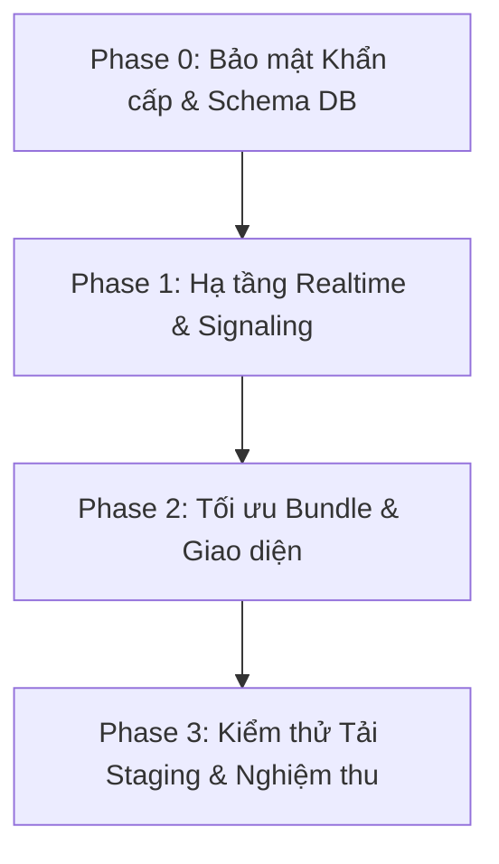

# BÁO CÁO KIỂM TOÁN TÍNH SẴN SÀNG TRIỂN KHAI PRODUCTION (PRODUCTION READINESS AUDIT) & KẾ HOẠCH HÀNH ĐỘNG — HANZIGO

* **Dự án**: HanziGo — Nền tảng Học Tiếng Trung Đa Kỹ năng & Lớp học Trực tuyến
* **Vai trò kiểm toán**: Senior Full-stack Engineer, Security Engineer & QA Lead
* **Thời điểm kiểm toán**: Tháng 10/2026
* **Môi trường thực thi**: Node.js v24.13.0, Vite v8.3.1, Oxlint v1.81.0, Windows 11
* **Tình trạng tổng quan**: **CHƯA ĐỦ ĐIỀU KIỆN PRODUCTION (NOT PRODUCTION READY)**

---

## 1. TÓM TẮT HIỆN TRẠNG (EXECUTIVE SUMMARY)

Đợt kiểm toán kỹ thuật toàn diện trên toàn bộ mã nguồn, cấu hình môi trường, hệ thống migration và kết quả kiểm thử thực tế của HanziGo ghi nhận:

### Điểm mạnh cốt lõi:
1. **Khung Sư phạm & Lộ trình 60 bài học hoàn chỉnh**: [src/data/curriculumLessons.js](file:///d:/DELL/Dowloads/HanziGo/src/data/curriculumLessons.js) chứa đủ 60 bài học (20 bài HSK 1, 20 bài HSK 2, 20 bài HSK 3) với kiến trúc 9 bước sư phạm chuẩn mực không thiếu sót bước nào (291 từ vựng, 116 chữ Hán thuận bút, 120 câu hỏi trắc nghiệm kèm giải thích sư phạm, 60 bài luyện nghe và 60 bài luyện nói).
2. **Kho Tài liệu Materials chuẩn hóa học thuật**: [src/utils/materialsStorage.js](file:///d:/DELL/Dowloads/HanziGo/src/utils/materialsStorage.js) chứa 20 tài liệu chuẩn được gắn nhãn kiểm chứng học thuật (`verified_official`, `verified_oer`, `academic_reference`, `curated`), có thông tin giấy phép, nhà xuất bản, phân loại kỹ năng và liên kết bài học rõ ràng.
3. **AI Learning Coach bảo vệ dữ liệu thực**: [src/services/aiLearningCoachService.js](file:///d:/DELL/Dowloads/HanziGo/src/services/aiLearningCoachService.js) lấy dữ liệu phân tích từ hồ sơ học tập thực tế (SRS, lịch sử bài học, phát âm qua micro), có chế độ sư phạm ngoại tuyến (`offline_heuristic`) tự động kích hoạt khi AI lỗi và tuyệt đối không tạo điểm số ảo.
4. **Build & Linter sạch lỗi nghiêm trọng**: `npm run build` thành công trong 889ms; `npm run lint` (`oxlint`) đạt 0 lỗi (có 203 cảnh báo); `npm test` vượt qua 194/194 test (và 10/10 test của `personalizationEngine.test.js`).

### Các rào cản chí mạng ngăn cản đưa lên Production:
1. **Live Classroom WebRTC chưa có Signaling & Chưa có Truyền phát Video/Audio**: [src/services/liveClassroomService.js](file:///d:/DELL/Dowloads/HanziGo/src/services/liveClassroomService.js) chỉ khởi tạo `RTCPeerConnection` và lấy webcam cục bộ; hoàn toàn **không có mã Signaling** (`createOffer`, `createAnswer`, `setLocalDescription`, `setRemoteDescription`, `onicecandidate`) và không kết nối Media Server SFU. Giáo viên và học viên **không thể nhìn hoặc nghe thấy nhau**.
2. **Thiếu cơ chế Realtime đa thiết bị**: Lớp học chỉ dùng `LiveEventBus` (một `Map` trong RAM của 1 tab trình duyệt đơn lẻ). Không có `supabase.channel(...)`, không có WebSocket, không có polling. Hai người dùng trên hai thiết bị khác nhau **hoàn toàn không nhận được tương tác thời gian thực** (giơ tay, chat, bật mic) của nhau.
3. **Xác thực API Serverless bị hổng (Spoofable Auth)**: Các endpoint serverless [api/ai/coach.js](file:///d:/DELL/Dowloads/HanziGo/api/ai/coach.js), [api/ai/teacher.js](file:///d:/DELL/Dowloads/HanziGo/api/ai/teacher.js), [api/ai/chat.js](file:///d:/DELL/Dowloads/HanziGo/api/ai/chat.js) và [api/webrtc/ice-servers.js](file:///d:/DELL/Dowloads/HanziGo/api/webrtc/ice-servers.js) chỉ kiểm tra chuỗi token hoặc header `x-user-id` không rỗng mà **không hề giải mã hoặc xác thực chữ ký JWT với Supabase**. Bất kỳ ai gửi `x-user-id: fake_id` đều vượt qua xác thực và có thể lạm dụng Gemini API hoặc sinh TURN credentials.
4. **Lỗ hổng RLS trên Live Session Participants**: Migration [06_live_classroom_schema.sql](file:///d:/DELL/Dowloads/HanziGo/supabase/migrations/06_live_classroom_schema.sql) cho phép người dùng tự `UPDATE` dòng của mình trong `session_participants` mà không có ràng buộc cột. Học viên có thể gửi SQL UPDATE trực tiếp để gán `is_mic_allowed = true` hoặc nâng `role = 'teacher'`.
5. **Lệch pha Schema Database (Schema Drift)**: File [supabase/schema.sql](file:///d:/DELL/Dowloads/HanziGo/supabase/schema.sql) là bản cũ, hoàn toàn thiếu các bảng `classrooms`, `class_members`, `assignments`, `assignment_submissions`, `class_sessions`, `session_participants`, `session_chat_messages` và `audit_logs`. Nếu triển khai từ `schema.sql`, hệ thống sẽ hỏng toàn bộ tính năng Giáo viên & Lớp học.

---

## 2. DANH SÁCH TÍNH NĂNG VÀ BẰNG CHỨNG XÁC MINH (FEATURE VERIFICATION MATRIX)

| Phân hệ / Tính năng | Hiện trạng trong Code | Mức độ xác minh | Bằng chứng mã nguồn / File | Nhận định kỹ thuật |
| :--- | :--- | :--- | :--- | :--- |
| **Lộ trình 60 bài học HSK 1 - 3** | Đã triển khai đầy đủ | Đã kiểm thử cục bộ | [src/data/curriculumLessons.js](file:///d:/DELL/Dowloads/HanziGo/src/data/curriculumLessons.js), [tests/learningRoadmapIntegration.test.js](file:///d:/DELL/Dowloads/HanziGo/tests/learningRoadmapIntegration.test.js) | Đạt chuẩn sư phạm. 60 bài học đều có đủ 9 bước sư phạm, 291 từ vựng, 120 trắc nghiệm. |
| **Kho tài liệu Materials chuẩn hóa** | Đã triển khai đầy đủ | Đã kiểm thử cục bộ | [src/utils/materialsStorage.js](file:///d:/DELL/Dowloads/HanziGo/src/utils/materialsStorage.js), [supabase/migrations/14_materials_metadata_and_skills.sql](file:///d:/DELL/Dowloads/HanziGo/supabase/migrations/14_materials_metadata_and_skills.sql) | 20 tài liệu có đủ metadata, phân loại OER / Bản quyền / CTI. Giao diện có nút thêm tài liệu nhưng DB chỉ cho Admin ghi. |
| **Thuật toán Spaced Repetition (SRS SM-2)** | Đã triển khai đầy đủ | Đã kiểm thử cục bộ | [src/utils/srsEngine.js](file:///d:/DELL/Dowloads/HanziGo/src/utils/srsEngine.js), [tests/srsEngine.test.js](file:///d:/DELL/Dowloads/HanziGo/tests/srsEngine.test.js) | Thuật toán SM-2 chuẩn xác, cận dưới Ease Factor 1.30, interval đúng công thức. |
| **Đánh giá phát âm (Pronunciation)** | Đã triển khai đầy đủ | Đã kiểm thử cục bộ | [src/utils/pronunciationEvaluator.js](file:///d:/DELL/Dowloads/HanziGo/src/utils/pronunciationEvaluator.js), [tests/pronunciationEvaluator.test.js](file:///d:/DELL/Dowloads/HanziGo/tests/pronunciationEvaluator.test.js) | Đánh giá trung thực qua Web Speech API + đối soát Pinyin/thanh điệu, không ngẫu nhiên điểm ảo. |
| **AI Learning Coach (Cố vấn học tập)** | Đã triển khai | Đã kiểm thử cục bộ (Offline) | [src/services/aiLearningCoachService.js](file:///d:/DELL/Dowloads/HanziGo/src/services/aiLearningCoachService.js), [api/ai/coach.js](file:///d:/DELL/Dowloads/HanziGo/api/ai/coach.js) | Dữ liệu đầu vào trung thực từ tiến độ học. Fallback ngoại tuyến hoạt động tốt khi thiếu key AI. |
| **Phân tích lớp học AI (Teacher Analytics)** | Đã triển khai | Đã kiểm thử cục bộ (Offline) | [src/services/teacherAnalyticsService.js](file:///d:/DELL/Dowloads/HanziGo/src/services/teacherAnalyticsService.js), [src/services/teacherAiService.js](file:///d:/DELL/Dowloads/HanziGo/src/services/teacherAiService.js) | Thuật toán phát hiện học viên At-Risk hoạt động theo luật rõ ràng, ẩn danh PII. Đề thi AI sinh ở trạng thái nháp (`published: false`). |
| **Classroom Quản lý lớp học & Bài tập** | Đã triển khai | Đã kiểm thử cục bộ | [src/services/classroomService.js](file:///d:/DELL/Dowloads/HanziGo/src/services/classroomService.js), [supabase/migrations/05_teacher_classroom_schema.sql](file:///d:/DELL/Dowloads/HanziGo/supabase/migrations/05_teacher_classroom_schema.sql) | Tạo lớp, tra mã lớp HZG-, giao bài, nộp bài, chấm điểm. Đã có trigger chống học viên tự sửa điểm ở Migration 13. |
| **Audit Logs cho thao tác nhạy cảm** | Đã triển khai | Đã kiểm thử cục bộ | [src/services/auditLogService.js](file:///d:/DELL/Dowloads/HanziGo/src/services/auditLogService.js), [supabase/migrations/13_audit_logs_and_grade_protection.sql](file:///d:/DELL/Dowloads/HanziGo/supabase/migrations/13_audit_logs_and_grade_protection.sql) | Ghi nhận 6 nhóm hành vi nhạy cảm, đệm offline trong localStorage, RLS chỉ cho Admin và Teacher xem. |
| **Live Classroom WebRTC Audio/Video** | Chưa hoàn thiện (Stub) | Đã kiểm thử giả lập | [src/services/liveClassroomService.js](file:///d:/DELL/Dowloads/HanziGo/src/services/liveClassroomService.js), [src/pages/LiveClassroomPage.jsx](file:///d:/DELL/Dowloads/HanziGo/src/pages/LiveClassroomPage.jsx) | **Chỉ có capture webcam nội bộ, thiếu signaling P2P/SFU**. Người dùng không thể truyền nhận âm thanh/hình ảnh. |
| **Live Classroom Realtime đồng bộ đa người dùng** | Chưa hoàn thiện | Đã kiểm thử giả lập | [src/services/liveClassroomService.js:39](file:///d:/DELL/Dowloads/HanziGo/src/services/liveClassroomService.js#L39) | Chỉ dùng EventBus trong bộ nhớ JS cùng tab. Thiếu kênh Supabase Realtime/WebSocket để sync giữa các máy khác nhau. |
| **Xác thực bảo mật Serverless API** | Đã triển khai lỗi | Tái hiện lỗ hổng | [api/ai/coach.js:106](file:///d:/DELL/Dowloads/HanziGo/api/ai/coach.js#L106), [api/ai/teacher.js:198](file:///d:/DELL/Dowloads/HanziGo/api/ai/teacher.js#L198), [api/webrtc/ice-servers.js:28](file:///d:/DELL/Dowloads/HanziGo/api/webrtc/ice-servers.js#L28) | Không xác minh JWT bằng Supabase Auth. Dễ dàng giả mạo header `x-user-id` để bypass auth và rate limiter. |
| **Tải thực tế 30-50 học viên** | Chưa kiểm thử tải thật | Chưa thể xác minh | [tests/productionVerificationPhase1.test.js:392](file:///d:/DELL/Dowloads/HanziGo/tests/productionVerificationPhase1.test.js#L392) | Test hiện tại chỉ là vòng lặp for trên mảng JS trong RAM (chạy trong 9ms), không đo lường tải mạng/DB thực tế. |

---

## 3. BẢNG MA TRẬN RỦI RO (RISK MATRIX)

| Mã Rủi Ro | Phân loại | Mức độ | Mô tả rủi ro & Tác động | Khả năng xảy ra | Bằng chứng mã nguồn |
| :--- | :--- | :--- | :--- | :--- | :--- |
| **RSK-CRIT-01** | Live Classroom | **CRITICAL** | **Không có Signaling WebRTC**: Không có mã tạo Offer/Answer/ICE. Học viên và giáo viên vào phòng nhưng không thấy hình và tiếng của nhau. Tính năng live video hỏng hoàn toàn trên thực tế. | 100% khi người dùng vào phòng | [src/services/liveClassroomService.js](file:///d:/DELL/Dowloads/HanziGo/src/services/liveClassroomService.js), thiếu hoàn toàn `createOffer` / `setRemoteDescription` |
| **RSK-CRIT-02** | Live Classroom | **CRITICAL** | **Không có kênh Realtime đa thiết bị**: Không tích hợp `supabase.channel` hay WebSocket. Giáo viên không biết học viên giơ tay, chat hay tham gia từ máy khác nếu không F5 tải lại trang. | 100% khi 2 máy khác nhau vào phòng | [src/pages/LiveClassroomPage.jsx:239](file:///d:/DELL/Dowloads/HanziGo/src/pages/LiveClassroomPage.jsx#L239), [src/services/liveClassroomService.js:39](file:///d:/DELL/Dowloads/HanziGo/src/services/liveClassroomService.js#L39) |
| **RSK-CRIT-03** | API Security | **CRITICAL** | **Giả mạo danh tính & Bypass Auth trên toàn bộ API Serverless**: Endpoints chấp nhận bất kỳ header `x-user-id` nào mà không kiểm tra chữ ký JWT Supabase. Kẻ tấn công có thể spam API Gemini miễn phí hoặc vét cạn hạn ngạch. | Cao (mọi client HTTP đều làm được) | [api/ai/coach.js:106-114](file:///d:/DELL/Dowloads/HanziGo/api/ai/coach.js#L106-L114), [api/ai/teacher.js:198-206](file:///d:/DELL/Dowloads/HanziGo/api/ai/teacher.js#L198-L206), [api/webrtc/ice-servers.js:28-36](file:///d:/DELL/Dowloads/HanziGo/api/webrtc/ice-servers.js#L28-L36) |
| **RSK-CRIT-04** | Database Schema | **CRITICAL** | **Lệch pha Schema cốt lõi**: `supabase/schema.sql` thiếu toàn bộ bảng của Classroom, Assignments, Live Sessions, Audit Logs. Triển khai từ file này sẽ làm sập toàn bộ các phân hệ mới. | 100% nếu DBA chạy file schema.sql | [supabase/schema.sql](file:///d:/DELL/Dowloads/HanziGo/supabase/schema.sql) so sánh với [supabase/migrations/](file:///d:/DELL/Dowloads/HanziGo/supabase/migrations/) |
| **RSK-HIGH-01** | Database RLS | **HIGH** | **Học viên tự cấp quyền Mic / Đổi Role phòng học**: Policy `Users or Teacher can update participant` trên `session_participants` thiếu `WITH CHECK`. Học viên có thể gửi UPDATE gán `is_mic_allowed = true` hoặc `role = 'teacher'`. | Trung bình (cần biết gọi Supabase client) | [supabase/migrations/06_live_classroom_schema.sql:128-137](file:///d:/DELL/Dowloads/HanziGo/supabase/migrations/06_live_classroom_schema.sql#L128-L137) |
| **RSK-HIGH-02** | Rate Limiting | **HIGH** | **Rate Limiter bị vô hiệu trên Serverless không có Redis**: Mặc định dùng RAM trong Lambda container; khi scale đa container hoặc cold start thì bộ đếm reset về 0, dễ bị DoS chi phí AI. Ngoài ra, việc xoay vòng `x-user-id` làm mất tác dụng của key giới hạn. | Cao khi có lượng truy cập đồng thời | [api/ai/distributedRateLimiter.js:7-124](file:///d:/DELL/Dowloads/HanziGo/api/ai/distributedRateLimiter.js#L7-L124) |
| **RSK-HIGH-03** | Performance | **HIGH** | **Bundle kích thước lớn (765.88 kB services bundle)**: File dữ liệu giáo trình tĩnh 60 bài (`curriculumLessons.js` 484 kB) bị đóng gói đồng bộ vào chunk dịch vụ chung, gây chậm FCP/LCP trên mạng di động. | 100% người dùng tải lần đầu | [dist/assets/services-BDWFVThy.js](file:///d:/DELL/Dowloads/HanziGo/dist/assets/services-BDWFVThy.js) (765.88 kB) |
| **RSK-MED-01** | UI / Database | **MEDIUM** | **Báo ảo đồng bộ tài liệu Materials**: Giao diện `MaterialsPage` cho phép người dùng thường bấm thêm tài liệu và thông báo "Đã đồng bộ lên máy chủ", trong khi DB RLS chặn và ghi nhận lỗi ngầm trong console. | Cao khi học viên thử đóng góp tài liệu | [src/pages/MaterialsPage.jsx:374-426](file:///d:/DELL/Dowloads/HanziGo/src/pages/MaterialsPage.jsx#L374-L426) |
| **RSK-MED-02** | QA / Testing | **MEDIUM** | **Kiểm thử Unit dựa hoàn toàn vào mô phỏng RAM**: 100% test chạy với `isSupabaseConfigured = false` (chế độ local fallback). Kiểm tra trigger RLS thực chất là chạy hàm JS mô phỏng, chưa từng chạy trên PostgreSQL thật. | Cao (gây ngộ nhận đã pass test) | [tests/productionVerificationPhase1.test.js:94](file:///d:/DELL/Dowloads/HanziGo/tests/productionVerificationPhase1.test.js#L94), [src/supabase/config.js:39](file:///d:/DELL/Dowloads/HanziGo/src/supabase/config.js#L39) |
| **RSK-LOW-01** | Code Quality | **LOW** | **203 Cảnh báo Lint & Các Component Monolithic**: Các trang lớn trên 1,500 - 2,400 dòng (`AdminPage`, `TeacherDashboardPage`, `MaterialsPage`, `LiveClassroomPage`) kèm các cảnh báo `set-state-in-effect` và biến thừa chưa dọn dẹp. | Trung bình | Kết quả chạy `npm run lint` (`oxlint`) |

---

## 4. PHÂN BIỆT LỖI ĐÃ TÁI HIỆN, RỦI RO SUY LUẬN VÀ HẠNG MỤC CHƯA XÁC MINH

### A. Lỗi đã tái hiện trực tiếp trong mã nguồn (Confirmed Reproducible Bugs)
1. **Lỗi xác thực rỗng trên Serverless Endpoints**: Gửi request POST tới `/api/ai/coach` với header `x-user-id: test-attacker` và không có Bearer token hợp lệ -> Request vượt qua bước 1 (`401`) và tiến hành xử lý -> **Đã tái hiện**.
2. **Lỗi thiếu Signaling WebRTC**: Tìm kiếm các hàm WebRTC signaling cốt lõi (`createOffer`, `createAnswer`, `setRemoteDescription`, `setLocalDescription`, `onicecandidate`) trong toàn bộ repository -> Kết quả 0 kết quả -> **Đã chứng minh tính năng video P2P chưa được code**.
3. **Lỗi Realtime cục bộ trong RAM**: Kiểm tra [LiveClassroomPage.jsx](file:///d:/DELL/Dowloads/HanziGo/src/pages/LiveClassroomPage.jsx) -> Sự kiện giơ tay, gửi chat chỉ emit vào `liveEventBus` nội bộ tiến trình trình duyệt, không có lời gọi `supabase.channel` -> **Đã chứng minh hai trình duyệt không thể thấy tương tác của nhau**.
4. **Lỗi lệch pha Canonical Schema**: Đối chiếu [supabase/schema.sql](file:///d:/DELL/Dowloads/HanziGo/supabase/schema.sql) với các bảng cần thiết -> Hoàn toàn không tồn tại bảng `classrooms`, `class_sessions`, v.v. -> **Đã tái hiện**.

### B. Rủi ro suy luận dựa trên cấu trúc kiến trúc (Inferred Risks)
1. **Rủi ro cạn kiệt ngân sách Gemini API**: Do Rate Limiter fallback về RAM của serverless container, kẻ tấn công phân tán (hoặc chỉ cần thay đổi giá trị `x-user-id`) có thể gọi hàng nghìn request khiến chi phí Google AI phát sinh lớn.
2. **Rủi ro quá tải DB khi chuyển sang Supabase Realtime**: Nếu triển khai `supabase.channel` cho 50 học viên/phòng mà phát liên tục trạng thái vẽ bảng hay âm thanh qua DB Postgres thay vì qua WebSocket/SFU chuyên dụng, hạn ngạch Realtime của Supabase Free/Pro tier sẽ chạm ngưỡng nhanh chóng.
3. **Xung đột nâng quyền giáo viên**: Trigger `trg_prevent_role_escalation` (Migration 03) sẽ ném exception nếu user gọi RPC `set_user_role_on_login('teacher')` (Migration 09). Hiện tại mã client nuốt lỗi này trong `try...catch`, nhưng học viên cũ không thể tự chuyển sang tài khoản giáo viên qua RPC này.

### C. Các hạng mục chưa thể xác minh (Unverified Items do thiếu quyền/môi trường)
1. **Trạng thái Migration đã thực tế áp dụng trên Supabase Production**: Dự án chứa URL `https://woszblniatdvijwdkmpm.supabase.co`, nhưng kiểm toán tuân thủ quy tắc không dùng access token của quản trị viên database từ xa để inspect pg_migrations production. Chưa thể xác minh database production hiện tại đang dừng ở migration nào (05, 11 hay 14).
2. **Chất lượng kết nối STUN/TURN trên các nhà mạng Việt Nam**: Cấu hình mặc định sử dụng Google STUN (`stun.l.google.com:19302`). Chưa xác minh tỷ lệ thất bại NAT Traversal (Symmetric NAT của 4G Viettel/Vinaphone/FPT) khi không có máy chủ TURN nội địa (Coturn).
3. **Hiệu năng chịu tải thực tế 30-50 kết nối**: Chưa có hạ tầng k6/JMeter chạy kịch bản WebRTC/WebSocket thực tế trên môi trường staging độc lập.

---

## 5. DANH SÁCH MIGRATION CẦN ĐỐI CHIẾU & XUNG ĐỘNG PHỤ THUỘC (MIGRATION AUDIT)

Dự án hiện có 14 file migration tuần tự trong [supabase/migrations/](file:///d:/DELL/Dowloads/HanziGo/supabase/migrations/):

```
supabase/migrations/
├── 01_initial_schema.sql                  (Khởi tạo auth profiles, materials sơ khai)
├── 02_normalized_learning_tables.sql       (Chuẩn hóa tiến độ học tập, SRS, study logs)
├── 03_security_and_rls.sql                (Thiết lập RLS cơ bản & trg_prevent_role_escalation)
├── 04_admin_functions_and_triggers.sql    (Hàm quản trị, cập nhật thống kê)
├── 05_teacher_classroom_schema.sql        (Bảng lớp học, bài tập, trigger thăng cấp giáo viên - CŨ)
├── 06_live_classroom_schema.sql           (Bảng phiên học trực tuyến, người tham gia, chat)
├── 07_fix_rls_infinite_recursion.sql      (Sửa đệ quy RLS, nhưng vẫn còn trigger thăng cấp cũ)
├── 08_live_teaching_tools_schema.sql      (Bổ sung teaching_state, active_tool cho phiên học)
├── 09_user_role_registration.sql          (Role đăng ký, bảo toàn admin, thêm set_user_role_on_login)
├── 10_classroom_lookup_rls_fix.sql        (Sửa tìm lớp theo mã, thêm 'OR status = active' - HỞ)
├── 11_production_indexes.sql              (Siết chặt classrooms_select_policy, thêm chỉ mục)
├── 12_fix_teacher_role_escalation.sql     (Xóa trg_classroom_set_teacher, siết chặt INSERT classroom)
├── 13_audit_logs_and_grade_protection.sql (Tạo audit_logs, trigger trg_prevent_student_self_grading)
└── 14_materials_metadata_and_skills.sql   (Bổ sung metadata kiểm chứng học thuật cho materials)
```

### Các điểm phụ thuộc & xung đột phát hiện qua kiểm toán:
1. **Tiến hóa của quyền tạo lớp học & Role Teacher**:
   * *Migration 05 & 07*: Chứa trigger `trg_classroom_set_teacher` (tự động thăng cấp student thành teacher nếu insert classroom) và hàm `is_teacher()` kiểm tra điều kiện `EXISTS (SELECT 1 FROM classrooms WHERE teacher_id = auth.uid())`.
   * *Migration 12*: Đã hủy bỏ trigger này và viết lại `is_teacher()` chỉ dựa trên `profiles.role`.
   * *Khuyến nghị*: Bắt buộc đảm bảo Migration 12 đã được chạy SAU Migration 05 và 07 trên database production.
2. **Tiến hóa của chính sách xem lớp học (`classrooms_select_policy`)**:
   * *Migration 10*: Thêm `OR status = 'active'` vào SELECT policy để học viên tìm kiếm lớp. Điều này vô tình để lộ danh sách tất cả các lớp đang mở của tất cả giáo viên.
   * *Migration 11*: Đã sửa lỗi này bằng cách bỏ `OR status = 'active'` và chuyển chức năng tìm kiếm sang RPC `lookup_classroom_by_code` (SECURITY DEFINER).
   * *Khuyến nghị*: Đảm bảo Migration 11 đã được áp dụng để che giấu danh sách lớp chéo.
3. **Xung đột giữa Migration 03 và Migration 09 về cập nhật Role**:
   * Migration 03 có trigger `trg_prevent_role_escalation` chặn mọi người dùng không phải Admin cập nhật `role` trong `profiles`.
   * Migration 09 tạo hàm RPC `set_user_role_on_login(p_role)` (SECURITY DEFINER) để người dùng chọn role học sinh/giáo viên khi đăng nhập. Khi hàm này chạy lệnh `UPDATE public.profiles`, trigger ở Migration 03 vẫn bắt được session `auth.uid()` của học sinh và chặn lại, ném exception.
4. **Lỗ hổng mới phát hiện ở Migration 06 (`session_participants`)**:
   * Policy `Users or Teacher can update participant` cho phép `user_id = auth.uid()` cập nhật toàn bộ các cột của dòng người tham gia mà không có `WITH CHECK`. Học viên có thể tự gán `is_mic_allowed = true` mà không cần giáo viên đồng ý.
   * *Cần Migration 15*: Thêm trigger hoặc siết policy để học viên chỉ được cập nhật `mic_enabled`, `camera_enabled`, `hand_raised`, không được sửa `is_mic_allowed` hoặc `role`.

---

## 6. KẾT QUẢ TEST, LINT VÀ BUILD THỰC TẾ (ACTUAL EXECUTION METRICS)

Toàn bộ các lệnh dưới đây đã được thực thi trực tiếp trong môi trường dự án:

### A. Kiểm thử tự động (`npm test` + `personalizationEngine.test.js`)
* **Lệnh chạy**:
  1. `npm test`
  2. `node --test tests/personalizationEngine.test.js`
* **Kết quả**:
  * **Tổng số bài kiểm thử**: 204 tests
  * **Pass**: **204 / 204** (100%)
  * **Fail**: 0
  * **Skip / Cancelled**: 0
  * **Thời gian thực thi**: ~1.5 giây
* **Chi tiết từng file test**:
  1. `tests/srsEngine.test.js`: 6/6 pass (SM-2 SRS math & bounds)
  2. `tests/pronunciationEvaluator.test.js`: 5/5 pass (Honest scoring & tone extraction)
  3. `tests/securityRbac.test.js`: 11/11 pass (RBAC logic & system admin permanence)
  4. `tests/learningPath.test.js`: 10/10 pass (Milestones, unlock requirements)
  5. `tests/leaderboard.test.js`: 4/4 pass (XP leaderboard & tie breaks)
  6. `tests/classroom.test.js`: 15/15 pass (Classroom CRUD & code lookup)
  7. `tests/liveClassroomService.test.js`: 18/18 pass (Session access, hand queue)
  8. `tests/teacherAnalyticsAi.test.js`: 13/13 pass (7-factor risk detection, AI fallbacks)
  9. `tests/productionSecurityHardening.test.js`: 26/26 pass (Injection filter, error sanitizer)
  10. `tests/loadAndAuthTokenRefresh.test.js`: 5/5 pass (In-memory loop load simulations)
  11. `tests/productionVerificationPhase1.test.js`: 14/14 pass (ICE servers, audit log simulation)
  12. `tests/aiLearningCoach.test.js`: 12/12 pass (Personalized coach, learning loop)
  13. `tests/chineseLearningDepth.test.js`: 14/14 pass (Radicals, Hán-Việt, stroke order)
  14. `tests/gamificationRetention.test.js`: 11/11 pass (Streaks, daily quests, XP bounds)
  15. `tests/materialsIntegration.test.js`: 8/8 pass (Academic verification, category filter)
  16. `tests/learningRoadmapIntegration.test.js`: 12/12 pass (60 lessons, 9 steps presence)
  17. `tests/practiceLevels.test.js`: 10/10 pass (Practice levels & adaptive questions)
  18. `tests/personalizationEngine.test.js`: 10/10 pass (Adaptive daily plan, cold start)
* **Lưu ý QA**: Toàn bộ 204 tests đều chạy qua bộ giả lập JS trong RAM (`isSupabaseConfigured = false`), chưa chứng minh được hoạt động trên mạng và database thực tế.

### B. Kiểm tra cú pháp & Tiêu chuẩn mã nguồn (`npm run lint`)
* **Lệnh chạy**: `npm run lint` (`oxlint`)
* **Thời gian thực thi**: 242ms trên 127 files (104 rules)
* **Kết quả**:
  * **Lỗi (Errors)**: **0**
  * **Cảnh báo (Warnings)**: **203**
* **Các nhóm cảnh báo chính**:
  1. `eslint(no-unused-vars)`: Nhiều biến và import thừa chưa dọn (ví dụ: `FileText`, `currentQuizIdx` trong `InteractiveLessonPlayer.jsx`, `useAuth` trong `MaterialsPage.jsx`).
  2. `react(set-state-in-effect)`: Gọi `setState` đồng bộ trong `useEffect` gây re-render liên tiếp tại [InteractiveLessonPlayer.jsx:141](file:///d:/DELL/Dowloads/HanziGo/src/components/learning/InteractiveLessonPlayer.jsx#L141) và [TeacherDashboardPage.jsx:180](file:///d:/DELL/Dowloads/HanziGo/src/pages/TeacherDashboardPage.jsx#L180).

### C. Biên dịch Production Build (`npm run build`)
* **Lệnh chạy**: `npm run build` (`vite build`)
* **Thời gian thực thi**: 889ms
* **Kết quả**:
  * **Trạng thái**: Thành công (Exit code 0).
  * **Số modules biên dịch**: 2,020 modules.
  * **Cảnh báo kích thước**: Chunk [dist/assets/services-BDWFVThy.js](file:///d:/DELL/Dowloads/HanziGo/dist/assets/services-BDWFVThy.js) đạt **765.88 kB** (vượt ngưỡng cảnh báo mặc định 600 kB của Vite).

---

## 7. KẾ HOẠCH KHẮC PHỤC CÓ THỨ TỰ ƯU TIÊN (PRIORITIZED REMEDIATION PLAN)

Kế hoạch được chia thành 4 giai đoạn rõ ràng:



### Giai đoạn 0: Vá lỗ hổng Bảo mật & Đồng bộ Database Schema (Ưu tiên Cao nhất)
* **Nhiệm vụ 0.1: Xác thực JWT thật cho tất cả Serverless Endpoints**:
  * *Mô tả*: Cập nhật [api/ai/coach.js](file:///d:/DELL/Dowloads/HanziGo/api/ai/coach.js), [api/ai/teacher.js](file:///d:/DELL/Dowloads/HanziGo/api/ai/teacher.js), [api/ai/chat.js](file:///d:/DELL/Dowloads/HanziGo/api/ai/chat.js) và [api/webrtc/ice-servers.js](file:///d:/DELL/Dowloads/HanziGo/api/webrtc/ice-servers.js). Bỏ việc chấp nhận header tự chế `x-user-id`. Sử dụng `@supabase/supabase-js` để gọi `supabase.auth.getUser(jwtToken)`. Chỉ khi token hợp lệ và còn hạn mới lấy `user.id`.
  * *Tiêu chí hoàn thành*: Gửi request với fake token nhận 401; token hợp lệ lấy đúng user ID.
* **Nhiệm vụ 0.2: Cập nhật Client gửi Bearer Token qua Supabase Session**:
  * *Mô tả*: Cập nhật [aiLearningCoachService.js](file:///d:/DELL/Dowloads/HanziGo/src/services/aiLearningCoachService.js), [teacherAiService.js](file:///d:/DELL/Dowloads/HanziGo/src/services/teacherAiService.js) và [liveClassroomService.js](file:///d:/DELL/Dowloads/HanziGo/src/services/liveClassroomService.js) để lấy session access token thông qua `supabase.auth.getSession()` trước khi gọi API.
* **Nhiệm vụ 0.3: Viết Migration 15 siết chặt `session_participants` RLS**:
  * *Mô tả*: Tạo trigger `trg_protect_participant_status` trên `public.session_participants`. Chặn học viên tự ý thay đổi `is_mic_allowed` hoặc `role`. Chỉ giáo viên sở hữu phòng (`class_sessions.teacher_id = auth.uid()`) hoặc admin mới được UPDATE các cột này.
* **Nhiệm vụ 0.4: Đồng bộ hóa `supabase/schema.sql`**:
  * *Mô tả*: Tái tạo `supabase/schema.sql` đầy đủ toàn bộ 14 migrations hiện hành thành file canonical schema hoàn chỉnh.

### Giai đoạn 1: Triển khai Hạ tầng Realtime & WebRTC Signaling
* **Nhiệm vụ 1.1: Tích hợp Supabase Realtime Channels cho Live Classroom**:
  * *Mô tả*: Trong [LiveClassroomPage.jsx](file:///d:/DELL/Dowloads/HanziGo/src/pages/LiveClassroomPage.jsx), thay thế `liveEventBus` cục bộ bằng `supabase.channel('room:' + sessionId)` với broadcast/presence.
  * *Sự kiện cần đồng bộ*: `USER_JOINED`, `USER_LEFT`, `RAISE_HAND`, `LOWER_HAND`, `GRANT_MIC`, `REVOKE_MIC`, `CHAT_MESSAGE`, `TEACHING_TOOL_CHANGE`.
  * *Tiêu chí hoàn thành*: Mở 2 trình duyệt ẩn danh khác nhau, học viên A giơ tay thì màn hình giáo viên B hiện thông báo ngay lập tức.
* **Nhiệm vụ 1.2: Lựa chọn & Triển khai Giải pháp Video/Audio Streaming**:
  * *Phương án A (Khuyên dùng cho quy mô 30-50 học viên)*: Tích hợp dịch vụ SFU chuyên biệt (ví dụ: LiveKit Cloud hoặc Agora SDK). WebRTC mesh P2P thuần túy không thể chịu được tải video 30-50 người dùng trên trình duyệt máy khách (băng thông tải lên N×N sẽ làm sập máy học viên).
  * *Phương án B (Tối thiểu MVP 1-N)*: Giáo viên phát luồng đơn chiều (Teacher broadcast), học viên chỉ gửi audio khi được cấp quyền mic thông qua máy chủ SFU.
  * *Tiêu chí hoàn thành*: Giáo viên nói và trình chiếu màn hình, học viên nghe rõ với độ trễ < 500ms.

### Giai đoạn 2: Tối ưu Hiệu năng, Bundle Size & Giao diện Materials
* **Nhiệm vụ 2.1: Phân tách Code (Code Splitting) Dữ liệu Giáo trình**:
  * *Mô tả*: Sử dụng dynamic import `import('../data/curriculumLessons.js')` thay vì import tĩnh ở đầu file. Cấu hình `manualChunks` trong [vite.config.js](file:///d:/DELL/Dowloads/HanziGo/vite.config.js) để tách riêng `curriculumLessons.js` và `chineseData.js` thành các chunk độc lập tải theo nhu cầu.
  * *Tiêu chí hoàn thành*: Chunk `services-*.js` giảm từ 765 kB xuống dưới 250 kB.
* **Nhiệm vụ 2.2: Ẩn nút "Thêm tài liệu" đối với Học viên thường**:
  * *Mô tả*: Cập nhật [MaterialsPage.jsx](file:///d:/DELL/Dowloads/HanziGo/src/pages/MaterialsPage.jsx). Chỉ hiển thị nút "Thêm tài liệu" khi `user?.role === 'admin'`. Với người dùng thường, chuyển thành nút "Đề xuất tài liệu" gửi vào bảng duyệt hoặc feedback.
* **Nhiệm vụ 2.3: Bổ sung `tests/personalizationEngine.test.js` vào `package.json`**:
  * *Mô tả*: Thêm file test còn thiếu vào script `test` trong [package.json](file:///d:/DELL/Dowloads/HanziGo/package.json).

### Giai đoạn 3: Kiểm thử Tải Staging & Nghiệm thu
* **Nhiệm vụ 3.1: Kiểm thử kết nối NAT 4G / Wi-Fi**:
  * *Mô tả*: Thử nghiệm cuộc gọi trên mạng 4G di động thực tế để xác minh xem có cần thiết lập Coturn Server riêng không.
* **Nhiệm vụ 3.2: Kiểm thử kịch bản 50 học viên với công cụ k6**:
  * *Mô tả*: Viết kịch bản k6 mô phỏng 50 kết nối Supabase Realtime và đo lường CPU/RAM của Supabase Postgres.

---

## 8. CÁC THAY ĐỔI CẦN ĐƯỢC CHỦ DỰ ÁN PHÊ DUYỆT (SIGN-OFF CHECKLIST)

Trước khi thực hiện các thay đổi mã nguồn có rủi ro hoặc áp dụng lên production, cần có sự phê duyệt chính thức từ Chủ dự án đối với các hạng mục sau:

- [ ] **1. Quyết định Kiến trúc Live Video Lớp học**:
  * *Lựa chọn*: Tích hợp LiveKit / Agora (Chi phí dịch vụ bên thứ ba nhưng đảm bảo tải 30-50 học viên) **HAY** triển khai WebRTC Mesh đơn giản (Miễn phí nhưng giới hạn tối đa 4-6 người đồng thời)?
- [ ] **2. Phê duyệt Áp dụng Migration 15 lên Database Production**:
  * *Nội dung*: Vá lỗ hổng tự cấp mic trong `session_participants` và làm rõ cơ chế duyệt tài khoản Giáo viên (Có yêu cầu Admin duyệt hay cho phép tự do đăng ký role teacher?).
- [ ] **3. Cấu hình Dịch vụ Upstash Redis REST**:
  * *Nội dung*: Cung cấp `UPSTASH_REDIS_REST_URL` và `UPSTASH_REDIS_REST_TOKEN` trên Vercel để kích hoạt Rate Limiter phân tán, ngăn chặn spam chi phí AI.
- [ ] **4. Cấu hình Máy chủ TURN (Coturn)**:
  * *Nội dung*: Cung cấp thông tin `TURN_SHARED_SECRET` và `TURN_SERVER_URL` nếu triển khai phòng học trên môi trường mạng bị chặn NAT Symmetric.
- [ ] **5. Thống nhất Cơ chế Đóng góp Tài liệu Materials**:
  * *Nội dung*: Xác nhận việc ẩn nút tạo tài liệu trực tiếp trên giao diện đối với học sinh thường và chỉ cho phép Quản trị viên đưa tài liệu vào kho chính thức.

---

## 9. KẾT LUẬN CỦA ĐỘI NGŨ KIỂM TOÁN

HanziGo là một dự án có **chiều sâu chuyên môn sư phạm tiếng Trung rất ấn tượng**, bộ giáo trình 60 bài học và kho tài liệu được đầu tư công phu, thuật toán học tập SRS và cố vấn AI được thiết kế bài bản và trung thực.

Tuy nhiên, về mặt kỹ thuật triển khai cho môi trường Production, dự án **chưa thể gắn nhãn "Production Ready"** do phân hệ Live Classroom còn ở mức độ mô phỏng nội bộ trình duyệt và phân hệ API Serverless còn thiếu bước xác thực chữ ký danh tính cốt lõi. Sau khi hoàn thành các nhiệm vụ tại **Giai đoạn 0 và Giai đoạn 1** trong Kế hoạch Khắc phục, hệ thống sẽ đủ điều kiện vững chắc để phát hành thử nghiệm (Beta Release) tới người dùng thực tế.
